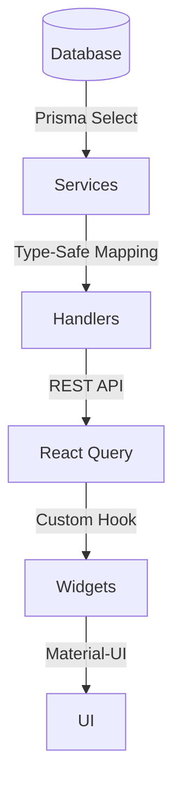

# Dashboard Architecture

## Overview
The dashboard provides a comprehensive overview of PoV (Proof of Value) activities, team performance, and resource utilization. It uses a modular widget-based architecture that allows for easy extension and maintenance.

## Architecture Components

### 1. Data Layer
- **Types**: Located in `lib/dashboard/types/`
  - Strongly typed interfaces for all dashboard data
  - Widget-specific type definitions (ActivePoVStats, TeamStatusData, etc.)
  - Prisma select types for efficient database queries
  - Standardized response wrappers for consistent API responses
  - Type-safe error handling with discriminated unions

Example type definitions:
```typescript
// Response wrapper for consistent API responses
interface DashboardResponse<T> {
  data: T;
  error?: {
    code: string;
    message: string;
  };
}

// Widget-specific data types with proper typing
interface POVWidgetData {
  id: string;
  title: string;
  status: POVStatus;
  priority: Priority;
  team: {
    id: string;
    name: string;
    members: Array<{
      user: {
        id: string;
        name: string;
        email: string;
      };
      role: TeamRole;
    }>;
  };
  phases: Array<{
    id: string;
    name: string;
    type: PhaseType;
    tasks: Array<{
      id: string;
      title: string;
      status: TaskStatus;
    }>;
  }>;
}
```

- **Services**: Located in `lib/dashboard/services/`
  - Centralized data fetching with type-safe implementations
  - Individual widget data functions
  - Batch fetching capabilities via getDashboardData
  - Comprehensive error handling and logging
  - Proper relation handling with Prisma includes

Example service implementation:
```typescript
export class DashboardService {
  async getPOVData(userId: string, isAdmin: boolean = false) {
    return prisma.pOV.findMany({
      where: isAdmin ? undefined : {
        OR: [
          { ownerId: userId },
          {
            team: {
              members: {
                some: {
                  userId: userId
                }
              }
            }
          }
        ]
      },
      include: {
        phases: {
          include: {
            tasks: true
          }
        },
        owner: true,
        team: {
          include: {
            members: {
              include: {
                user: true
              }
            }
          }
        }
      },
      orderBy: {
        createdAt: 'desc'
      }
    });
  }
}
```

- **Prisma Layer**: Located in `lib/dashboard/prisma/`
  - Optimized database queries with specific select types
  - Type-safe data mappers for each widget
  - Clear separation between database and API types

### 2. API Layer
- **Handlers**: Located in `lib/dashboard/handlers/`
  - Single endpoint supporting both individual and batch widget requests
  - Authentication via getAuthUser middleware
  - Type-safe request handling with proper error responses
  - Query parameter support for widget-specific data fetching

### 3. UI Layer
- **Widgets**: Located in `components/dashboard/widgets/`
  - ActivePoVs: Overview of active PoV statuses and counts
  - TeamStatus: Team member activities and task statistics
  - Milestones: Phase tracking with progress indicators
  - ResourceUsage: Resource allocation across team, tasks, and timeline
  - RiskOverview: Risk metrics and category analysis
  - SuccessRate: Success metrics with historical data

Each widget implements:
- Skeleton loading states using Material-UI
- Error handling with Alert components
- Type-safe data consumption via useDashboardData hook
- Responsive layouts with proper spacing

### 4. State Management
- **@tanstack/react-query Integration**
  - Automatic data caching and background updates
  - Configurable polling:
    ```typescript
    staleTime: 30000,      // Data considered fresh for 30 seconds
    refetchInterval: 60000 // Refetch every minute
    ```
  - Type-safe data fetching via useDashboardData hook
  - Comprehensive error handling with retry logic
  - Smart retry strategy:
    - No retries for database connection errors
    - No retries for auth errors
    - Up to 3 retries for other errors with exponential backoff
  - Query key management (['dashboard', widgetName])

## Widget Implementation Pattern

Each widget follows a consistent implementation pattern:

1. **Data Fetching**
   ```typescript
   const { data, isLoading, error } = useDashboardData('widgetName');
   ```

2. **Loading State**
   ```typescript
   if (isLoading) {
     return (
       <Card>
         <CardContent>
           <Skeleton /> // Widget-specific skeleton layout
         </CardContent>
       </Card>
     );
   }
   ```

3. **Error Handling**
   ```typescript
   if (error) {
     return (
       <Card>
         <CardContent>
           <Alert severity="error">Failed to load data</Alert>
         </CardContent>
       </Card>
     );
   }
   ```

4. **Data Display**
   ```typescript
   return (
     <Card>
       <CardContent>
         // Widget-specific data visualization
       </CardContent>
     </Card>
   );
   ```

## Data Flow



## Security Considerations

1. **Authentication**
   - JWT-based authentication via getAuthUser middleware
   - Protected API routes
   - Type-safe user context

2. **Data Access**
   - Proper error handling for unauthorized access
   - Database connection validation
   - Comprehensive error logging

## Testing Strategy

1. **Unit Tests**
   - Widget component testing
   - Service function testing
   - Mapper function testing

2. **Integration Tests**
   - API endpoint testing
   - Database query testing
   - React Query integration testing

## Development Guidelines

1. **Code Organization**
   - Feature-based directory structure
   - Clear separation between types, services, and UI
   - Consistent file naming and exports

2. **Type Safety**
   - Strict TypeScript usage throughout
   - Comprehensive interface definitions
   - Proper type narrowing and validation

3. **State Management**
   - React Query for server state
   - Loading state handling
   - Error boundary implementation

4. **Styling**
   - Material-UI components and system
   - Responsive design patterns
   - Consistent spacing and layout

## Performance Considerations

1. **Data Fetching**
   - Optimized Prisma queries with specific selects
   - Batch fetching capability
   - Proper connection management

2. **UI Rendering**
   - Skeleton loading states
   - Proper React Query configuration
   - Efficient re-render management

3. **Error Handling**
   - Graceful fallbacks
   - User-friendly error messages
   - Proper error logging

## Future Enhancements

1. **Widget Customization**
   - User-specific widget preferences
   - Customizable refresh intervals
   - Widget visibility toggles
   - Role-based widget access control

2. **Advanced Analytics**
   - Trend analysis
   - Predictive metrics
   - Custom reporting
   - KPI tracking and history

3. **Performance Optimizations**
   - Data pagination
   - Caching improvements
   - Bundle size optimization
   - Optimized Prisma queries with specific includes

4. **Enhanced Visualization**
   - Additional chart types
   - Interactive data exploration
   - Export capabilities
   - Real-time updates via WebSocket

5. **Data Management**
   - Improved error handling
   - Better JSON parsing error handling
   - Proper error status codes
   - Enhanced token validation error handling

6. **Testing Improvements**
   - Comprehensive API testing
   - End-to-end widget testing
   - Performance testing
   - Load testing for data fetching
