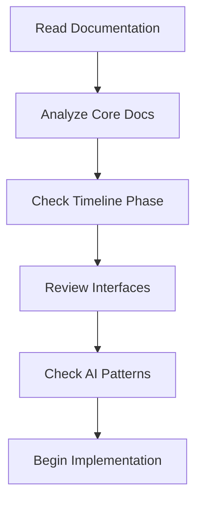

# AI Implementation Guide

## Overview

This guide provides specific patterns and approaches for AI assistants implementing the POV system. It focuses on consistent implementation strategies, common patterns, and best practices for AI-assisted development.

## Implementation Workflow

### 1. Understanding Requirements



#### Documentation Order
1. Read implementation-guide.md first
2. Review relevant core documentation
3. Check current timeline phase
4. Review interface specifications
5. Check common patterns

### 2. Implementation Approach

#### Step-by-Step Process
1. Analyze requirements
2. Plan implementation steps
3. Create/modify database schema
4. Implement services
5. Create API endpoints
6. Build UI components
7. Add tests
8. Update documentation

## Common Implementation Patterns

### Database Operations

```typescript
// Prisma Schema Pattern
model EntityName {
  id        String   @id @default(cuid())
  name      String
  status    Status   @default(DRAFT)
  metadata  Json?
  createdAt DateTime @default(now())
  updatedAt DateTime @updatedAt

  @@index([status])
}

// Service Pattern
class EntityService {
  constructor(private prisma: PrismaClient) {}

  async create(data: CreateInput): Promise<Entity> {
    return this.prisma.entity.create({
      data: {
        ...data,
        metadata: {},
      },
    });
  }

  async update(id: string, data: UpdateInput): Promise<Entity> {
    return this.prisma.entity.update({
      where: { id },
      data,
    });
  }
}
```

### API Implementation

```typescript
// Route Handler Pattern
export async function POST(req: Request) {
  try {
    const data = await req.json();
    const validated = await validateInput(data);
    const result = await service.create(validated);
    return Response.json(result);
  } catch (error) {
    return handleApiError(error);
  }
}

// Validation Pattern
const validateInput = async (data: unknown): Promise<ValidatedData> => {
  const schema = z.object({
    name: z.string().min(1),
    status: z.enum(['DRAFT', 'ACTIVE', 'ARCHIVED']),
    metadata: z.record(z.unknown()).optional(),
  });
  return schema.parseAsync(data);
};
```

### React Components

```typescript
// Component Pattern
interface EntityProps {
  data: Entity;
  onUpdate?: (updates: Partial<Entity>) => Promise<void>;
}

const EntityComponent: React.FC<EntityProps> = ({ data, onUpdate }) => {
  const queryClient = useQueryClient();
  const mutation = useMutation({
    mutationFn: (updates: Partial<Entity>) => 
      api.updateEntity(data.id, updates),
    onSuccess: () => {
      queryClient.invalidateQueries(['entity', data.id]);
    },
  });

  return (
    <div>
      {/* Implementation */}
    </div>
  );
};
```

## Testing Patterns

### Unit Tests

```typescript
// Service Test Pattern
describe('EntityService', () => {
  let service: EntityService;
  let prisma: MockPrismaClient;

  beforeEach(() => {
    prisma = createMockPrismaClient();
    service = new EntityService(prisma);
  });

  it('should create entity', async () => {
    const data = { name: 'Test' };
    const result = await service.create(data);
    expect(result).toMatchObject(data);
  });
});

// Component Test Pattern
describe('EntityComponent', () => {
  it('should render entity data', () => {
    const data = { id: '1', name: 'Test' };
    const { getByText } = render(<EntityComponent data={data} />);
    expect(getByText('Test')).toBeInTheDocument();
  });
});
```

## Error Handling

### API Error Pattern

```typescript
// Error Handler
const handleApiError = (error: unknown): Response => {
  if (error instanceof ValidationError) {
    return Response.json(
      { error: 'Validation Error', details: error.errors },
      { status: 400 }
    );
  }

  if (error instanceof PrismaError) {
    return Response.json(
      { error: 'Database Error' },
      { status: 500 }
    );
  }

  console.error('Unhandled error:', error);
  return Response.json(
    { error: 'Internal Server Error' },
    { status: 500 }
  );
};
```

### Component Error Pattern

```typescript
// Error Boundary Pattern
class ErrorBoundary extends React.Component<ErrorBoundaryProps> {
  state = { error: null };

  static getDerivedStateFromError(error: Error) {
    return { error };
  }

  render() {
    if (this.state.error) {
      return <ErrorDisplay error={this.state.error} />;
    }
    return this.props.children;
  }
}

// Error Display Pattern
const ErrorDisplay: React.FC<{ error: Error }> = ({ error }) => (
  <div role="alert" className="error-display">
    <h3>Error</h3>
    <p>{error.message}</p>
  </div>
);
```

## Performance Patterns

### Query Optimization

```typescript
// Prisma Query Pattern
const getEntityWithRelations = async (id: string) => {
  return prisma.entity.findUnique({
    where: { id },
    include: {
      // Only include necessary relations
      relation1: {
        select: {
          id: true,
          name: true,
        },
      },
    },
  });
};

// Pagination Pattern
const listEntities = async (
  page: number,
  limit: number,
  filter?: EntityFilter
) => {
  const [items, total] = await Promise.all([
    prisma.entity.findMany({
      where: filter,
      skip: (page - 1) * limit,
      take: limit,
      orderBy: { createdAt: 'desc' },
    }),
    prisma.entity.count({ where: filter }),
  ]);

  return { items, total };
};
```

### React Query Pattern

```typescript
// Query Hook Pattern
const useEntity = (id: string) => {
  return useQuery({
    queryKey: ['entity', id],
    queryFn: () => api.getEntity(id),
    staleTime: 5 * 60 * 1000, // 5 minutes
  });
};

// Mutation Hook Pattern
const useUpdateEntity = () => {
  const queryClient = useQueryClient();
  return useMutation({
    mutationFn: (data: UpdateEntityInput) => 
      api.updateEntity(data.id, data),
    onSuccess: (_, { id }) => {
      queryClient.invalidateQueries(['entity', id]);
    },
  });
};
```

## Documentation Patterns

### Code Documentation

```typescript
/**
 * Creates a new entity with the given data
 * @param data - The entity creation data
 * @throws {ValidationError} If the data is invalid
 * @throws {DatabaseError} If the database operation fails
 * @returns The created entity
 */
async function createEntity(data: CreateEntityInput): Promise<Entity> {
  // Implementation
}

/**
 * Component that displays and manages an entity
 * @param data - The entity data to display
 * @param onUpdate - Optional callback for entity updates
 */
const EntityComponent: React.FC<EntityProps> = ({ data, onUpdate }) => {
  // Implementation
};
```

### Implementation Comments

```typescript
// Service Implementation
class EntityService {
  // Step 1: Validate input data
  private async validateInput(data: unknown) {
    // Implementation
  }

  // Step 2: Prepare data for database
  private prepareData(validated: ValidatedData) {
    // Implementation
  }

  // Step 3: Perform database operation
  private async saveToDatabase(prepared: PreparedData) {
    // Implementation
  }
}

// Component Implementation
const EntityComponent: React.FC<EntityProps> = ({ data }) => {
  // Step 1: Set up state and hooks
  const [state, setState] = useState(initialState);

  // Step 2: Define event handlers
  const handleEvent = () => {
    // Implementation
  };

  // Step 3: Render component
  return (
    // Implementation
  );
};
```

## Best Practices

### Code Organization
- Follow established patterns
- Use consistent naming
- Maintain type safety
- Document edge cases

### Testing
- Write comprehensive tests
- Test edge cases
- Mock external dependencies
- Validate error handling

### Performance
- Optimize database queries
- Implement caching
- Use pagination
- Monitor performance

### Documentation
- Keep docs current
- Document changes
- Include examples
- Explain edge cases
