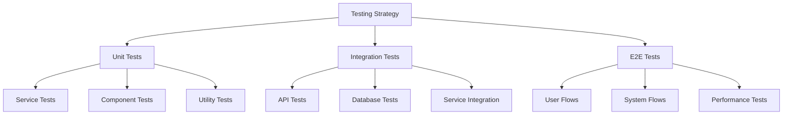

# Testing Approach for AI-Assisted Development

## Overview

This document outlines testing strategies and patterns specifically designed for AI-assisted development of the POV system. It provides structured approaches to ensure code quality and reliability.

## Testing Hierarchy



## Unit Testing Patterns

### Service Testing

```typescript
// Service Test Template
describe('EntityService', () => {
  let service: EntityService;
  let prisma: MockPrismaClient;
  let deps: {
    otherService: MockOtherService;
    validator: MockValidator;
  };

  // Setup
  beforeEach(() => {
    prisma = createMockPrismaClient();
    deps = {
      otherService: createMockOtherService(),
      validator: createMockValidator(),
    };
    service = new EntityService(prisma, deps);
  });

  // Happy Path Tests
  describe('create', () => {
    const validData = {
      name: 'Test Entity',
      status: 'ACTIVE',
    };

    it('should create entity with valid data', async () => {
      const result = await service.create(validData);
      expect(result).toMatchObject(validData);
      expect(prisma.entity.create).toHaveBeenCalledWith({
        data: expect.objectContaining(validData),
      });
    });

    it('should generate default metadata', async () => {
      const result = await service.create(validData);
      expect(result.metadata).toBeDefined();
    });
  });

  // Error Path Tests
  describe('error handling', () => {
    it('should throw on invalid data', async () => {
      const invalidData = { invalid: true };
      await expect(service.create(invalidData))
        .rejects
        .toThrow(ValidationError);
    });

    it('should handle database errors', async () => {
      prisma.entity.create.mockRejectedValue(new Error('DB Error'));
      await expect(service.create(validData))
        .rejects
        .toThrow('Database operation failed');
    });
  });
});
```

### Component Testing

```typescript
// Component Test Template
describe('EntityComponent', () => {
  // Test Data
  const mockData = {
    id: '1',
    name: 'Test Entity',
    status: 'ACTIVE',
  };

  // Render Tests
  describe('rendering', () => {
    it('should render in default state', () => {
      const { getByText } = render(
        <EntityComponent data={mockData} />
      );
      expect(getByText(mockData.name)).toBeInTheDocument();
      expect(getByText(mockData.status)).toBeInTheDocument();
    });

    it('should render loading state', () => {
      const { getByRole } = render(
        <EntityComponent data={mockData} loading />
      );
      expect(getByRole('progressbar')).toBeInTheDocument();
    });

    it('should render error state', () => {
      const error = new Error('Test Error');
      const { getByText } = render(
        <EntityComponent data={mockData} error={error} />
      );
      expect(getByText(/test error/i)).toBeInTheDocument();
    });
  });

  // Interaction Tests
  describe('interactions', () => {
    it('should handle edit action', async () => {
      const onEdit = jest.fn();
      const { getByRole } = render(
        <EntityComponent data={mockData} onEdit={onEdit} />
      );

      await userEvent.click(getByRole('button', { name: /edit/i }));
      expect(onEdit).toHaveBeenCalledWith(mockData.id);
    });

    it('should handle delete action with confirmation', async () => {
      const onDelete = jest.fn();
      const { getByRole, getByText } = render(
        <EntityComponent data={mockData} onDelete={onDelete} />
      );

      await userEvent.click(getByRole('button', { name: /delete/i }));
      await userEvent.click(getByText(/confirm/i));
      expect(onDelete).toHaveBeenCalledWith(mockData.id);
    });
  });

  // Form Tests
  describe('form handling', () => {
    it('should handle form submission', async () => {
      const onSubmit = jest.fn();
      const { getByRole, getByLabelText } = render(
        <EntityComponent data={mockData} onSubmit={onSubmit} />
      );

      await userEvent.type(getByLabelText(/name/i), 'Updated Name');
      await userEvent.click(getByRole('button', { name: /save/i }));
      
      expect(onSubmit).toHaveBeenCalledWith({
        ...mockData,
        name: 'Updated Name',
      });
    });

    it('should validate form inputs', async () => {
      const { getByRole, getByText } = render(
        <EntityComponent data={mockData} />
      );

      await userEvent.clear(getByRole('textbox', { name: /name/i }));
      await userEvent.click(getByRole('button', { name: /save/i }));

      expect(getByText(/name is required/i)).toBeInTheDocument();
    });
  });
});
```

## Integration Testing Patterns

### API Testing

```typescript
// API Test Template
describe('EntityAPI', () => {
  let app: Express;
  let prisma: PrismaClient;

  // Setup
  beforeAll(async () => {
    app = await createTestApp();
    prisma = new PrismaClient();
  });

  // Cleanup
  afterAll(async () => {
    await prisma.$disconnect();
  });

  // Route Tests
  describe('POST /api/entities', () => {
    const validPayload = {
      name: 'Test Entity',
      status: 'ACTIVE',
    };

    it('should create entity with valid payload', async () => {
      const response = await request(app)
        .post('/api/entities')
        .send(validPayload);

      expect(response.status).toBe(201);
      expect(response.body).toMatchObject(validPayload);
    });

    it('should validate request payload', async () => {
      const response = await request(app)
        .post('/api/entities')
        .send({ invalid: true });

      expect(response.status).toBe(400);
      expect(response.body.error).toMatch(/validation/i);
    });
  });

  // Authorization Tests
  describe('authorization', () => {
    it('should require authentication', async () => {
      const response = await request(app)
        .get('/api/entities');

      expect(response.status).toBe(401);
    });

    it('should check permissions', async () => {
      const token = createTestToken({ role: 'USER' });
      const response = await request(app)
        .post('/api/entities')
        .set('Authorization', `Bearer ${token}`)
        .send(validPayload);

      expect(response.status).toBe(403);
    });
  });
});
```

### Database Testing

```typescript
// Database Test Template
describe('EntityRepository', () => {
  let prisma: PrismaClient;

  // Setup
  beforeAll(async () => {
    prisma = new PrismaClient();
    await prisma.$connect();
  });

  // Cleanup
  afterAll(async () => {
    await prisma.$disconnect();
  });

  // Reset
  beforeEach(async () => {
    await prisma.entity.deleteMany();
  });

  // Query Tests
  describe('queries', () => {
    it('should find by custom criteria', async () => {
      const entity = await prisma.entity.create({
        data: {
          name: 'Test',
          status: 'ACTIVE',
        },
      });

      const result = await prisma.entity.findFirst({
        where: {
          status: 'ACTIVE',
        },
      });

      expect(result).toMatchObject(entity);
    });
  });

  // Transaction Tests
  describe('transactions', () => {
    it('should handle transactions', async () => {
      const result = await prisma.$transaction(async (tx) => {
        const entity = await tx.entity.create({
          data: {
            name: 'Test',
            status: 'ACTIVE',
          },
        });

        await tx.entityHistory.create({
          data: {
            entityId: entity.id,
            action: 'CREATE',
          },
        });

        return entity;
      });

      expect(result).toBeDefined();
    });
  });
});
```

## E2E Testing Patterns

### User Flow Testing

```typescript
// User Flow Test Template
describe('Entity Management Flow', () => {
  let page: Page;

  // Setup
  beforeAll(async () => {
    page = await browser.newPage();
  });

  // Cleanup
  afterAll(async () => {
    await page.close();
  });

  // Flow Tests
  it('should complete entity creation flow', async () => {
    // Navigate to create page
    await page.goto('/entities/new');
    
    // Fill form
    await page.fill('[name="entityName"]', 'Test Entity');
    await page.selectOption('[name="status"]', 'ACTIVE');
    
    // Submit form
    await page.click('button[type="submit"]');
    
    // Verify success
    await expect(page).toHaveURL(/entities\/[\w-]+$/);
    await expect(page.locator('h1')).toHaveText('Test Entity');
  });

  it('should handle validation errors', async () => {
    await page.goto('/entities/new');
    
    // Submit without required fields
    await page.click('button[type="submit"]');
    
    // Verify error messages
    await expect(page.locator('.error-message'))
      .toHaveText(/name is required/i);
  });
});
```

### System Flow Testing

```typescript
// System Flow Test Template
describe('System Integration Flow', () => {
  let app: Express;
  let prisma: PrismaClient;

  // Setup
  beforeAll(async () => {
    app = await createTestApp();
    prisma = new PrismaClient();
  });

  // Flow Tests
  it('should handle complete business flow', async () => {
    // Step 1: Create entity
    const entityResponse = await request(app)
      .post('/api/entities')
      .send({ name: 'Test Entity' });
    
    const entityId = entityResponse.body.id;
    
    // Step 2: Update status
    await request(app)
      .patch(`/api/entities/${entityId}/status`)
      .send({ status: 'ACTIVE' });
    
    // Step 3: Verify workflow
    const workflowResponse = await request(app)
      .get(`/api/entities/${entityId}/workflow`);
    
    expect(workflowResponse.body.status).toBe('COMPLETED');
  });
});
```

## Performance Testing

### Load Testing

```typescript
// Load Test Template
describe('API Load Tests', () => {
  it('should handle concurrent requests', async () => {
    const concurrency = 50;
    const requests = Array(concurrency).fill(null).map(() =>
      request(app)
        .get('/api/entities')
        .set('Authorization', `Bearer ${token}`)
    );
    
    const responses = await Promise.all(requests);
    
    responses.forEach(response => {
      expect(response.status).toBe(200);
    });
  });

  it('should maintain response times', async () => {
    const start = Date.now();
    
    await request(app)
      .get('/api/entities')
      .set('Authorization', `Bearer ${token}`);
    
    const duration = Date.now() - start;
    expect(duration).toBeLessThan(200); // 200ms threshold
  });
});
```

### Stress Testing

```typescript
// Stress Test Template
describe('System Stress Tests', () => {
  it('should handle data volume', async () => {
    // Create large dataset
    const items = Array(1000).fill(null).map((_, i) => ({
      name: `Test ${i}`,
      status: 'ACTIVE',
    }));
    
    await prisma.entity.createMany({ data: items });
    
    // Test pagination
    const response = await request(app)
      .get('/api/entities')
      .query({ page: 1, limit: 100 });
    
    expect(response.status).toBe(200);
    expect(response.body.items).toHaveLength(100);
  });
});
```

## Best Practices

### Test Organization
- Group related tests
- Use descriptive names
- Follow AAA pattern (Arrange, Act, Assert)
- Keep tests focused

### Test Coverage
- Aim for high coverage
- Test edge cases
- Include error scenarios
- Verify business rules

### Test Maintenance
- Keep tests simple
- Use test utilities
- Share test data
- Update with changes
