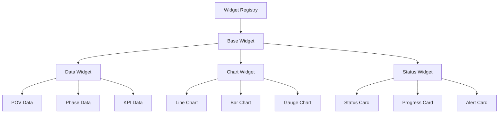

# Dashboard Widget System

## Overview

The Dashboard Widget System provides a flexible, extensible framework for creating and managing dashboard widgets. It supports both user dashboards (POV-specific views) and admin dashboards (system-wide views) with a plugin-based architecture.

## Core Components

### Widget Architecture



### Base Types

```typescript
interface BaseWidget {
  id: string;
  type: string;
  title: string;
  description?: string;
  position: {
    x: number;
    y: number;
    width: number;
    height: number;
  };
  permissions: Permission[];
  refreshInterval?: number;
  metadata?: Record<string, unknown>;
}

interface WidgetData<T = unknown> {
  timestamp: Date;
  data: T;
  error?: string;
  loading?: boolean;
  metadata?: Record<string, unknown>;
}

interface WidgetConfig {
  type: string;
  dataSource: DataSourceConfig;
  visualization: VisualizationConfig;
  defaultPosition: Position;
  permissions: Permission[];
  metadata?: Record<string, unknown>;
}
```

### Data Sources

```typescript
interface DataSourceConfig {
  type: 'api' | 'graphql' | 'websocket' | 'function';
  config: {
    endpoint?: string;
    query?: string;
    transform?: string;  // JavaScript function as string
    variables?: Record<string, unknown>;
    refreshInterval?: number;
  };
}

interface DataFetcher<T = unknown> {
  fetch(): Promise<T>;
  subscribe?(callback: (data: T) => void): () => void;
}

class WidgetDataService {
  async fetchData<T>(config: DataSourceConfig): Promise<WidgetData<T>>
  createDataFetcher<T>(config: DataSourceConfig): DataFetcher<T>
  validateConfig(config: DataSourceConfig): ValidationResult
}
```

### Visualization Types

```typescript
interface VisualizationConfig {
  type: 'chart' | 'grid' | 'card' | 'custom';
  config: {
    type?: ChartType;
    options?: Record<string, unknown>;
    component?: string;  // Custom component name
  };
}

interface ChartConfig {
  type: 'line' | 'bar' | 'gauge' | 'pie';
  options: {
    colors?: string[];
    labels?: string[];
    axes?: {
      x?: AxisConfig;
      y?: AxisConfig;
    };
    legend?: LegendConfig;
    tooltip?: TooltipConfig;
  };
}

interface CardConfig {
  type: 'status' | 'progress' | 'alert';
  options: {
    icon?: string;
    color?: string;
    format?: string;
    threshold?: {
      warning?: number;
      critical?: number;
    };
  };
}
```

## Implementation

### Widget Registry

```typescript
class WidgetRegistry {
  // Registration
  async registerWidget(type: string, config: WidgetConfig): Promise<void>
  async unregisterWidget(type: string): Promise<void>
  
  // Retrieval
  async getWidget(type: string): Promise<WidgetConfig>
  async listWidgets(): Promise<WidgetConfig[]>
  
  // Validation
  async validateWidget(type: string, config: unknown): Promise<ValidationResult>
}

// Usage
widgetRegistry.registerWidget('povProgress', {
  type: 'povProgress',
  dataSource: {
    type: 'api',
    config: {
      endpoint: '/api/pov/{povId}/progress',
      refreshInterval: 30000
    }
  },
  visualization: {
    type: 'chart',
    config: {
      type: 'gauge',
      options: {
        min: 0,
        max: 100,
        units: '%'
      }
    }
  },
  defaultPosition: { x: 0, y: 0, width: 2, height: 2 },
  permissions: ['VIEW_POV']
});
```

### Dashboard Layout

```typescript
interface DashboardLayout {
  id: string;
  userId: string;
  widgets: Array<{
    id: string;
    type: string;
    position: Position;
    config?: Record<string, unknown>;
  }>;
  metadata?: Record<string, unknown>;
}

class DashboardLayoutService {
  // Layout Management
  async saveLayout(userId: string, layout: DashboardLayout): Promise<void>
  async getLayout(userId: string): Promise<DashboardLayout>
  async resetLayout(userId: string): Promise<void>
  
  // Widget Management
  async addWidget(userId: string, widget: BaseWidget): Promise<void>
  async removeWidget(userId: string, widgetId: string): Promise<void>
  async updateWidget(userId: string, widgetId: string, updates: Partial<BaseWidget>): Promise<void>
}
```

### React Components

```typescript
// Dashboard Grid
interface DashboardGridProps {
  layout: DashboardLayout;
  onLayoutChange: (layout: DashboardLayout) => void;
  onWidgetAdd: (widget: BaseWidget) => void;
  onWidgetRemove: (widgetId: string) => void;
}

const DashboardGrid: React.FC<DashboardGridProps> = () => {
  // Implementation using react-grid-layout
};

// Widget Container
interface WidgetContainerProps {
  widget: BaseWidget;
  data: WidgetData;
  onUpdate: (updates: Partial<BaseWidget>) => void;
  onRemove: () => void;
}

const WidgetContainer: React.FC<WidgetContainerProps> = () => {
  // Implementation
};

// Widget Catalog
interface WidgetCatalogProps {
  onSelect: (widgetType: string) => void;
}

const WidgetCatalog: React.FC<WidgetCatalogProps> = () => {
  // Implementation
};
```

## Built-in Widgets

### POV Widgets

```typescript
// POV Progress Widget
interface POVProgressConfig extends WidgetConfig {
  type: 'povProgress';
  dataSource: {
    endpoint: '/api/pov/{povId}/progress';
  };
  visualization: {
    type: 'gauge';
    options: {
      min: 0;
      max: 100;
      units: '%';
    };
  };
}

// POV Timeline Widget
interface POVTimelineConfig extends WidgetConfig {
  type: 'povTimeline';
  dataSource: {
    endpoint: '/api/pov/{povId}/timeline';
  };
  visualization: {
    type: 'chart';
    options: {
      type: 'gantt';
    };
  };
}
```

### KPI Widgets

```typescript
// KPI Trend Widget
interface KPITrendConfig extends WidgetConfig {
  type: 'kpiTrend';
  dataSource: {
    endpoint: '/api/pov/{povId}/kpi/{kpiId}/trend';
  };
  visualization: {
    type: 'chart';
    options: {
      type: 'line';
    };
  };
}

// KPI Status Widget
interface KPIStatusConfig extends WidgetConfig {
  type: 'kpiStatus';
  dataSource: {
    endpoint: '/api/pov/{povId}/kpi/{kpiId}/status';
  };
  visualization: {
    type: 'card';
    options: {
      type: 'status';
    };
  };
}
```

## Extension Points

### Custom Data Sources

```typescript
interface CustomDataSource {
  type: string;
  fetchData: (config: unknown) => Promise<unknown>;
  validateConfig: (config: unknown) => ValidationResult;
}

// Registration
class DataSourceRegistry {
  async registerDataSource(type: string, source: CustomDataSource): Promise<void>
  async unregisterDataSource(type: string): Promise<void>
}
```

### Custom Visualizations

```typescript
interface CustomVisualization {
  type: string;
  component: React.ComponentType<any>;
  validateConfig: (config: unknown) => ValidationResult;
}

// Registration
class VisualizationRegistry {
  async registerVisualization(type: string, viz: CustomVisualization): Promise<void>
  async unregisterVisualization(type: string): Promise<void>
}
```

## Testing Strategy

### Unit Tests

```typescript
describe('WidgetRegistry', () => {
  it('should register widget type', async () => {
    // Test implementation
  });

  it('should validate widget config', async () => {
    // Test implementation
  });
});

describe('DataSourceService', () => {
  it('should fetch data correctly', async () => {
    // Test implementation
  });

  it('should handle errors gracefully', async () => {
    // Test implementation
  });
});
```

### Integration Tests

```typescript
describe('Dashboard Integration', () => {
  it('should load user layout', async () => {
    // Test implementation
  });

  it('should update widget data', async () => {
    // Test implementation
  });
});
```

## Performance Considerations

1. **Data Loading**
   - Lazy widget loading
   - Data caching
   - Refresh throttling

2. **Rendering**
   - Virtual scrolling
   - Debounced updates
   - Optimized redraws

3. **State Management**
   - Efficient updates
   - Minimal rerenders
   - Local state

## Security Considerations

1. **Data Access**
   - Permission validation
   - Data filtering
   - Scope checking

2. **Configuration**
   - Input validation
   - Safe defaults
   - Error boundaries

3. **Extension Safety**
   - Sandbox evaluation
   - Resource limits
   - Error isolation
