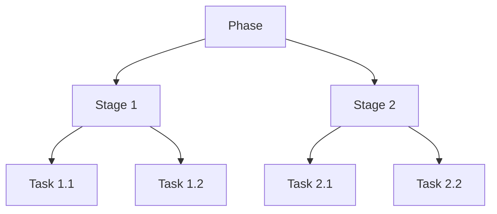

# Phase System Architecture

## Overview

The Phase System manages the lifecycle of phases, stages, and tasks within POVs. It provides a flexible, hierarchical structure that supports both user-friendly interfaces (like Kanban boards) and powerful admin configuration.

## Core Components

### Phase Hierarchy



### Data Models

```typescript
interface Phase {
  id: string;
  povId: string;
  type: PhaseType;
  name: string;
  description?: string;
  status: PhaseStatus;
  stages: Stage[];
  startDate: Date;
  endDate: Date;
  metadata?: Record<string, unknown>;
}

interface Stage {
  id: string;
  phaseId: string;
  name: string;
  description?: string;
  status: StageStatus;
  tasks: Task[];
  order: number;
  metadata?: Record<string, unknown>;
}

interface Task {
  id: string;
  stageId: string;
  name: string;
  description?: string;
  status: TaskStatus;
  assignedTo?: string;
  dueDate?: Date;
  order: number;
  metadata?: Record<string, unknown>;
}

enum PhaseStatus {
  NOT_STARTED = 'NOT_STARTED',
  IN_PROGRESS = 'IN_PROGRESS',
  COMPLETED = 'COMPLETED',
  ON_HOLD = 'ON_HOLD'
}

enum StageStatus {
  PENDING = 'PENDING',
  ACTIVE = 'ACTIVE',
  COMPLETED = 'COMPLETED',
  BLOCKED = 'BLOCKED'
}

enum TaskStatus {
  TODO = 'TODO',
  IN_PROGRESS = 'IN_PROGRESS',
  REVIEW = 'REVIEW',
  DONE = 'DONE',
  BLOCKED = 'BLOCKED'
}
```

### Database Schema

```prisma
model Phase {
  id          String      @id @default(cuid())
  povId       String
  pov         POV         @relation(fields: [povId], references: [id], onDelete: Cascade, onUpdate: Cascade)
  typeId      String
  type        PhaseType   @relation(fields: [typeId], references: [id])
  name        String
  description String?
  status      PhaseStatus @default(NOT_STARTED)
  startDate   DateTime
  endDate     DateTime
  stages      Stage[]
  metadata    Json?
  createdAt   DateTime    @default(now())
  updatedAt   DateTime    @updatedAt

  @@index([povId])
  @@index([typeId])
  @@index([status])
}

model Stage {
  id          String      @id @default(cuid())
  phaseId     String
  phase       Phase       @relation(fields: [phaseId], references: [id], onDelete: Cascade, onUpdate: Cascade)
  name        String
  description String?
  status      StageStatus @default(PENDING)
  order       Int
  tasks       Task[]
  metadata    Json?
  createdAt   DateTime    @default(now())
  updatedAt   DateTime    @updatedAt

  @@index([phaseId])
  @@index([status])
}

model Task {
  id          String     @id @default(cuid())
  stageId     String
  stage       Stage      @relation(fields: [stageId], references: [id], onDelete: Cascade, onUpdate: Cascade)
  name        String
  description String?
  status      TaskStatus @default(TODO)
  assignedTo  String?
  dueDate     DateTime?
  order       Int
  metadata    Json?
  createdAt   DateTime   @default(now())
  updatedAt   DateTime   @updatedAt

  @@index([stageId])
  @@index([status])
  @@index([assignedTo])
}
```

## User Interface

### Kanban Board

```typescript
// Kanban Board Component
interface KanbanBoardProps {
  phaseId: string;
  onTaskMove: (taskId: string, newStageId: string, newOrder: number) => Promise<void>;
  onTaskUpdate: (taskId: string, updates: Partial<Task>) => Promise<void>;
}

const KanbanBoard: React.FC<KanbanBoardProps> = () => {
  // Implementation using react-beautiful-dnd
};

// Stage Column Component
interface StageColumnProps {
  stage: Stage;
  tasks: Task[];
  onTaskDrop: (taskId: string, newOrder: number) => Promise<void>;
}

const StageColumn: React.FC<StageColumnProps> = () => {
  // Implementation
};

// Task Card Component
interface TaskCardProps {
  task: Task;
  onUpdate: (updates: Partial<Task>) => Promise<void>;
}

const TaskCard: React.FC<TaskCardProps> = () => {
  // Implementation
};
```

### Admin Interface

```typescript
// Phase Type Configuration
interface PhaseTypeConfig {
  id: string;
  name: string;
  defaultStages: Array<{
    name: string;
    order: number;
    metadata?: Record<string, unknown>;
  }>;
  validationRules: ValidationRule[];
  metadata?: Record<string, unknown>;
}

// Phase Configuration Form
interface PhaseConfigFormProps {
  initialData?: PhaseTypeConfig;
  onSubmit: (data: PhaseTypeConfig) => Promise<void>;
}

const PhaseConfigForm: React.FC<PhaseConfigFormProps> = () => {
  // Implementation
};
```

## Service Layer

### Phase Service

```typescript
class PhaseService {
  // Phase Management
  async createPhase(data: CreatePhaseInput): Promise<Phase>
  async updatePhase(id: string, data: UpdatePhaseInput): Promise<Phase>
  async deletePhase(id: string): Promise<void>
  async getPhase(id: string): Promise<Phase>
  async listPhases(povId: string): Promise<Phase[]>

  // Stage Management
  async createStage(phaseId: string, data: CreateStageInput): Promise<Stage>
  async updateStage(id: string, data: UpdateStageInput): Promise<Stage>
  async deleteStage(id: string): Promise<void>
  async reorderStages(phaseId: string, order: string[]): Promise<void>

  // Task Management
  async createTask(stageId: string, data: CreateTaskInput): Promise<Task>
  async updateTask(id: string, data: UpdateTaskInput): Promise<Task>
  async deleteTask(id: string): Promise<void>
  async moveTask(id: string, newStageId: string, newOrder: number): Promise<Task>
  
  // Status Management
  async updatePhaseStatus(id: string, status: PhaseStatus): Promise<Phase>
  async updateStageStatus(id: string, status: StageStatus): Promise<Stage>
  async updateTaskStatus(id: string, status: TaskStatus): Promise<Task>
}
```

### Validation Service

```typescript
class PhaseValidationService {
  // Validation
  async validatePhase(phase: Phase): Promise<ValidationResult>
  async validateStage(stage: Stage): Promise<ValidationResult>
  async validateTask(task: Task): Promise<ValidationResult>
  
  // Status Validation
  async validateStatusTransition(
    type: 'PHASE' | 'STAGE' | 'TASK',
    currentStatus: string,
    newStatus: string
  ): Promise<ValidationResult>
  
  // Timeline Validation
  async validateTimeline(phase: Phase): Promise<ValidationResult>
}
```

## API Routes

```typescript
// Phase Routes
interface PhaseRoutes {
  // Create phase
  'POST /api/pov/[povId]/phases': {
    body: CreatePhaseInput;
    response: Phase;
  };
  
  // Update phase
  'PUT /api/pov/[povId]/phases/[phaseId]': {
    body: UpdatePhaseInput;
    response: Phase;
  };
  
  // Get phase
  'GET /api/pov/[povId]/phases/[phaseId]': {
    response: Phase;
  };
}

// Stage Routes
interface StageRoutes {
  // Create stage
  'POST /api/phases/[phaseId]/stages': {
    body: CreateStageInput;
    response: Stage;
  };
  
  // Update stage
  'PUT /api/stages/[stageId]': {
    body: UpdateStageInput;
    response: Stage;
  };
  
  // Reorder stages
  'PUT /api/phases/[phaseId]/stages/reorder': {
    body: { order: string[] };
    response: void;
  };
}

// Task Routes
interface TaskRoutes {
  // Create task
  'POST /api/stages/[stageId]/tasks': {
    body: CreateTaskInput;
    response: Task;
  };
  
  // Update task
  'PUT /api/tasks/[taskId]': {
    body: UpdateTaskInput;
    response: Task;
  };
  
  // Move task
  'PUT /api/tasks/[taskId]/move': {
    body: {
      stageId: string;
      order: number;
    };
    response: Task;
  };
}
```

## Integration Points

### POV System
- Phase creation on POV creation
- Status synchronization
- Resource allocation

### Launch System
- Phase completion validation
- Resource verification
- Timeline validation

### KPI System
- Progress tracking
- Performance metrics
- Timeline analysis

## Extension Points

### Custom Fields

```typescript
interface CustomField {
  id: string;
  entityType: 'PHASE' | 'STAGE' | 'TASK';
  name: string;
  type: 'string' | 'number' | 'boolean' | 'date' | 'enum';
  required: boolean;
  validation?: ValidationRule[];
  metadata?: Record<string, unknown>;
}

class CustomFieldService {
  async addCustomField(entityType: string, field: CustomField): Promise<void>
  async updateCustomField(fieldId: string, updates: Partial<CustomField>): Promise<void>
  async removeCustomField(fieldId: string): Promise<void>
}
```

### Status Workflows

```typescript
interface StatusWorkflow {
  id: string;
  entityType: 'PHASE' | 'STAGE' | 'TASK';
  transitions: Array<{
    from: string;
    to: string;
    conditions?: ValidationRule[];
    actions?: WorkflowAction[];
  }>;
  metadata?: Record<string, unknown>;
}

class StatusWorkflowService {
  async createWorkflow(workflow: StatusWorkflow): Promise<void>
  async validateTransition(
    entityType: string,
    from: string,
    to: string
  ): Promise<ValidationResult>
}
```

## Testing Strategy

### Unit Tests

```typescript
describe('PhaseService', () => {
  it('should create phase with stages', async () => {
    // Test implementation
  });

  it('should validate status transitions', async () => {
    // Test implementation
  });

  it('should handle task movements', async () => {
    // Test implementation
  });
});
```

### Integration Tests

```typescript
describe('Phase System Integration', () => {
  it('should integrate with POV system', async () => {
    // Test implementation
  });

  it('should handle KPI updates', async () => {
    // Test implementation
  });

  it('should validate launch requirements', async () => {
    // Test implementation
  });
});
```

## Performance Considerations

1. **Optimistic Updates**
   - Task movement
   - Status changes
   - Order updates

2. **Batch Operations**
   - Stage reordering
   - Task updates
   - Status changes

3. **Caching Strategy**
   - Phase data
   - Stage order
   - Task lists

## Security Considerations

1. **Access Control**
   - Role-based permissions
   - Team member validation
   - Resource-level security

2. **Data Validation**
   - Input sanitization
   - Status transitions
   - Timeline validation

3. **Audit Trail**
   - Status changes
   - Task movements
   - Assignment changes
