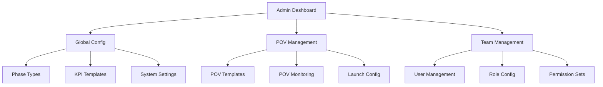

# Admin Interface Implementation

## Overview

This document details the admin-facing interfaces of the POV system, focusing on configuration, management, and monitoring capabilities. The interfaces provide powerful tools for administrators while maintaining usability.

## Core Admin Interfaces

### Admin Dashboard



## Configuration Components

### Phase Type Configuration

```typescript
// Phase Type Editor
interface PhaseTypeEditorProps {
  initialData?: PhaseType;
  onSave: (data: PhaseType) => Promise<void>;
}

const PhaseTypeEditor: React.FC<PhaseTypeEditorProps> = () => {
  // Implementation using form library
};

// Stage Template Editor
interface StageTemplateEditorProps {
  stages: StageTemplate[];
  onChange: (stages: StageTemplate[]) => void;
}

const StageTemplateEditor: React.FC<StageTemplateEditorProps> = () => {
  // Implementation with drag-and-drop reordering
};
```

### KPI Template Management

```typescript
// KPI Template Form
interface KPITemplateFormProps {
  template?: KPITemplate;
  onSubmit: (data: KPITemplate) => Promise<void>;
}

const KPITemplateForm: React.FC<KPITemplateFormProps> = () => {
  // Implementation
};

// Calculation Editor
interface CalculationEditorProps {
  value: string;
  onChange: (value: string) => void;
  onValidate: () => Promise<ValidationResult>;
}

const CalculationEditor: React.FC<CalculationEditorProps> = () => {
  // Implementation using Monaco Editor
};
```

### Team Configuration

```typescript
// Role Configuration
interface RoleConfigProps {
  role: Role;
  onUpdate: (updates: Partial<Role>) => Promise<void>;
}

const RoleConfig: React.FC<RoleConfigProps> = () => {
  // Implementation
};

// Permission Matrix
interface PermissionMatrixProps {
  role: Role;
  permissions: Permission[];
  onUpdate: (permissions: Permission[]) => Promise<void>;
}

const PermissionMatrix: React.FC<PermissionMatrixProps> = () => {
  // Implementation
};
```

## Management Interfaces

### POV Template Management

```typescript
// Template Builder
interface TemplateBuilderProps {
  template?: POVTemplate;
  onSave: (template: POVTemplate) => Promise<void>;
}

const TemplateBuilder: React.FC<TemplateBuilderProps> = () => {
  // Implementation
};

// Phase Configuration
interface PhaseConfigProps {
  phases: Phase[];
  onUpdate: (phases: Phase[]) => Promise<void>;
}

const PhaseConfig: React.FC<PhaseConfigProps> = () => {
  // Implementation
};
```

### Launch Configuration

```typescript
// Launch Checklist Builder
interface ChecklistBuilderProps {
  checklist: LaunchChecklist;
  onChange: (checklist: LaunchChecklist) => void;
}

const ChecklistBuilder: React.FC<ChecklistBuilderProps> = () => {
  // Implementation
};

// Validation Rule Editor
interface ValidationRuleEditorProps {
  rules: ValidationRule[];
  onUpdate: (rules: ValidationRule[]) => Promise<void>;
}

const ValidationRuleEditor: React.FC<ValidationRuleEditorProps> = () => {
  // Implementation
};
```

## Monitoring Components

### System Monitoring

```typescript
// System Status Dashboard
interface SystemStatusProps {
  metrics: SystemMetrics;
  onRefresh: () => Promise<void>;
}

const SystemStatus: React.FC<SystemStatusProps> = () => {
  // Implementation
};

// Error Log Viewer
interface ErrorLogProps {
  logs: ErrorLog[];
  onFilter: (filter: LogFilter) => void;
}

const ErrorLog: React.FC<ErrorLogProps> = () => {
  // Implementation
};
```

### POV Monitoring

```typescript
// POV Status Overview
interface POVStatusOverviewProps {
  povs: POV[];
  filter: POVFilter;
  onFilterChange: (filter: POVFilter) => void;
}

const POVStatusOverview: React.FC<POVStatusOverviewProps> = () => {
  // Implementation
};

// Activity Monitor
interface ActivityMonitorProps {
  activities: Activity[];
  onFilter: (filter: ActivityFilter) => void;
}

const ActivityMonitor: React.FC<ActivityMonitorProps> = () => {
  // Implementation
};
```

## Configuration Forms

### System Settings

```typescript
// Global Settings Form
interface GlobalSettingsFormProps {
  settings: GlobalSettings;
  onUpdate: (settings: GlobalSettings) => Promise<void>;
}

const GlobalSettingsForm: React.FC<GlobalSettingsFormProps> = () => {
  // Implementation
};

// Feature Flags
interface FeatureFlagsProps {
  flags: FeatureFlag[];
  onToggle: (flagId: string, enabled: boolean) => Promise<void>;
}

const FeatureFlags: React.FC<FeatureFlagsProps> = () => {
  // Implementation
};
```

### User Management

```typescript
// User Editor
interface UserEditorProps {
  user?: User;
  onSave: (data: User) => Promise<void>;
}

const UserEditor: React.FC<UserEditorProps> = () => {
  // Implementation
};

// Bulk User Actions
interface BulkUserActionsProps {
  selectedUsers: string[];
  onAction: (action: BulkAction) => Promise<void>;
}

const BulkUserActions: React.FC<BulkUserActionsProps> = () => {
  // Implementation
};
```

## Advanced Features

### Geographical Management

```typescript
// Region Management
interface RegionManagerProps {
  regions: Region[];
  onAdd: (region: Region) => Promise<void>;
  onUpdate: (id: string, updates: Partial<Region>) => Promise<void>;
  onDelete: (id: string) => Promise<void>;
}

const RegionManager: React.FC<RegionManagerProps> = () => {
  // Implementation
};

// Country Management
interface CountryManagerProps {
  countries: Country[];
  regions: Region[];
  onAdd: (country: Country) => Promise<void>;
  onUpdate: (id: string, updates: Partial<Country>) => Promise<void>;
  onDelete: (id: string) => Promise<void>;
}

const CountryManager: React.FC<CountryManagerProps> = () => {
  // Implementation
};

// Geographical Assignment
interface GeographicalAssignmentProps {
  povs: POV[];
  onBulkUpdate: (updates: GeographicalUpdate[]) => Promise<void>;
}

interface GeographicalUpdate {
  povId: string;
  salesTheatre?: SalesTheatre;
  regionId?: string;
  countryId?: string;
}

const GeographicalAssignment: React.FC<GeographicalAssignmentProps> = () => {
  // Implementation with bulk assignment capabilities
};

// Geographical Analytics
interface GeographicalAnalyticsProps {
  data: {
    byTheatre: Record<SalesTheatre, number>;
    byRegion: Record<string, number>;
    byCountry: Record<string, number>;
  };
  onDateRangeChange: (range: DateRange) => void;
}

const GeographicalAnalytics: React.FC<GeographicalAnalyticsProps> = () => {
  // Implementation with charts and metrics
};
```

### Custom Field Configuration

```typescript
// Field Builder
interface FieldBuilderProps {
  field?: CustomField;
  onSave: (field: CustomField) => Promise<void>;
}

const FieldBuilder: React.FC<FieldBuilderProps> = () => {
  // Implementation
};

// Validation Builder
interface ValidationBuilderProps {
  validation?: ValidationRule;
  onSave: (validation: ValidationRule) => Promise<void>;
}

const ValidationBuilder: React.FC<ValidationBuilderProps> = () => {
  // Implementation
};
```

### Workflow Configuration

```typescript
// Workflow Editor
interface WorkflowEditorProps {
  workflow?: Workflow;
  onSave: (workflow: Workflow) => Promise<void>;
}

const WorkflowEditor: React.FC<WorkflowEditorProps> = () => {
  // Implementation
};

// Status Flow Editor
interface StatusFlowEditorProps {
  flow?: StatusFlow;
  onSave: (flow: StatusFlow) => Promise<void>;
}

const StatusFlowEditor: React.FC<StatusFlowEditorProps> = () => {
  // Implementation
};
```

## Security Features

### Role Management

```typescript
// Role Editor
interface RoleEditorProps {
  role?: Role;
  onSave: (role: Role) => Promise<void>;
}

const RoleEditor: React.FC<RoleEditorProps> = () => {
  // Implementation
};

// Permission Editor
interface PermissionEditorProps {
  permission?: Permission;
  onSave: (permission: Permission) => Promise<void>;
}

const PermissionEditor: React.FC<PermissionEditorProps> = () => {
  // Implementation
};
```

### Audit Features

```typescript
// Audit Log Viewer
interface AuditLogViewerProps {
  logs: AuditLog[];
  filter: AuditFilter;
  onFilterChange: (filter: AuditFilter) => void;
}

const AuditLogViewer: React.FC<AuditLogViewerProps> = () => {
  // Implementation
};

// Change History
interface ChangeHistoryProps {
  entity: {
    type: string;
    id: string;
  };
  changes: Change[];
}

const ChangeHistory: React.FC<ChangeHistoryProps> = () => {
  // Implementation
};
```

## Performance Features

### Caching Controls

```typescript
// Cache Manager
interface CacheManagerProps {
  caches: CacheInfo[];
  onClear: (cacheId: string) => Promise<void>;
}

const CacheManager: React.FC<CacheManagerProps> = () => {
  // Implementation
};

// Preload Controls
interface PreloadControlsProps {
  configs: PreloadConfig[];
  onToggle: (configId: string, enabled: boolean) => Promise<void>;
}

const PreloadControls: React.FC<PreloadControlsProps> = () => {
  // Implementation
};
```

### System Optimization

```typescript
// Performance Monitor
interface PerformanceMonitorProps {
  metrics: PerformanceMetrics;
  onThresholdChange: (updates: Partial<Thresholds>) => Promise<void>;
}

const PerformanceMonitor: React.FC<PerformanceMonitorProps> = () => {
  // Implementation
};

// Resource Usage
interface ResourceUsageProps {
  usage: ResourceMetrics;
  limits: ResourceLimits;
  onLimitChange: (updates: Partial<ResourceLimits>) => Promise<void>;
}

const ResourceUsage: React.FC<ResourceUsageProps> = () => {
  // Implementation
};
