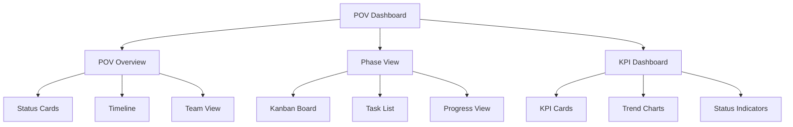

# User Interface Implementation

## Overview

This document details the user-facing interfaces of the POV system, focusing on providing intuitive, efficient interactions for regular users. The interfaces are designed to be user-friendly while maintaining powerful functionality.

## Core User Interfaces

### POV Dashboard



### Component Structure

```typescript
// Geographical Selection
interface GeographicalSelectorProps {
  value?: {
    salesTheatre?: SalesTheatre;
    regionId?: string;
    countryId?: string;
  };
  onChange: (value: {
    salesTheatre?: SalesTheatre;
    regionId?: string;
    countryId?: string;
  }) => void;
  disabled?: boolean;
}

const GeographicalSelector: React.FC<GeographicalSelectorProps> = () => {
  // Implementation using cascading selects
};

// Location Display
interface LocationDisplayProps {
  salesTheatre?: SalesTheatre;
  region?: Region;
  country?: Country;
  compact?: boolean;
}

const LocationDisplay: React.FC<LocationDisplayProps> = () => {
  // Implementation with formatted display
};

// Geographical Filter
interface GeographicalFilterProps {
  value: {
    salesTheatres?: SalesTheatre[];
    regionIds?: string[];
    countryIds?: string[];
  };
  onChange: (filters: {
    salesTheatres?: SalesTheatre[];
    regionIds?: string[];
    countryIds?: string[];
  }) => void;
}

const GeographicalFilter: React.FC<GeographicalFilterProps> = () => {
  // Implementation with multi-select filters
};

// POV Overview
interface POVOverviewProps {
  povId: string;
  onPhaseSelect?: (phaseId: string) => void;
  onKPISelect?: (kpiId: string) => void;
}

const POVOverview: React.FC<POVOverviewProps> = () => {
  // Implementation using status cards, timeline, and team view
};

// Phase Kanban Board
interface KanbanBoardProps {
  phaseId: string;
  onTaskMove: (taskId: string, newStageId: string, newOrder: number) => Promise<void>;
  onTaskUpdate: (taskId: string, updates: Partial<Task>) => Promise<void>;
}

const KanbanBoard: React.FC<KanbanBoardProps> = () => {
  // Implementation using react-beautiful-dnd
};

// KPI Dashboard
interface KPIDashboardProps {
  povId: string;
  onKPIUpdate?: (kpiId: string, value: number) => Promise<void>;
}

const KPIDashboard: React.FC<KPIDashboardProps> = () => {
  // Implementation using widget system
};
```

## User Interactions

### POV Navigation

```typescript
// POV Navigation Bar
interface POVNavBarProps {
  povId: string;
  activeView: 'overview' | 'phases' | 'kpis';
  onViewChange: (view: string) => void;
}

const POVNavBar: React.FC<POVNavBarProps> = () => {
  // Implementation
};

// POV Breadcrumbs
interface POVBreadcrumbsProps {
  povId: string;
  phaseId?: string;
  stageId?: string;
  taskId?: string;
}

const POVBreadcrumbs: React.FC<POVBreadcrumbsProps> = () => {
  // Implementation
};
```

### Task Management

```typescript
// Task Card
interface TaskCardProps {
  task: Task;
  onUpdate: (updates: Partial<Task>) => Promise<void>;
  onStatusChange: (newStatus: TaskStatus) => Promise<void>;
}

const TaskCard: React.FC<TaskCardProps> = () => {
  // Implementation
};

// Task Details Modal
interface TaskDetailsModalProps {
  task: Task;
  onUpdate: (updates: Partial<Task>) => Promise<void>;
  onClose: () => void;
}

const TaskDetailsModal: React.FC<TaskDetailsModalProps> = () => {
  // Implementation
};
```

### KPI Interactions

```typescript
// KPI Update Form
interface KPIUpdateFormProps {
  kpi: KPI;
  onUpdate: (value: number) => Promise<void>;
}

const KPIUpdateForm: React.FC<KPIUpdateFormProps> = () => {
  // Implementation
};

// KPI History View
interface KPIHistoryProps {
  kpi: KPI;
  history: KPIHistory[];
}

const KPIHistory: React.FC<KPIHistoryProps> = () => {
  // Implementation
};
```

## Layout Components

### Responsive Grid

```typescript
// Responsive Grid Layout
interface GridLayoutProps {
  breakpoints: {
    sm: number;
    md: number;
    lg: number;
    xl: number;
  };
  cols: {
    sm: number;
    md: number;
    lg: number;
    xl: number;
  };
  children: React.ReactNode;
}

const GridLayout: React.FC<GridLayoutProps> = () => {
  // Implementation using CSS Grid
};
```

### Card Components

```typescript
// Status Card
interface StatusCardProps {
  title: string;
  value: string | number;
  trend?: number;
  status?: 'success' | 'warning' | 'error';
  icon?: React.ReactNode;
}

const StatusCard: React.FC<StatusCardProps> = () => {
  // Implementation
};

// Progress Card
interface ProgressCardProps {
  title: string;
  progress: number;
  target: number;
  status?: 'on-track' | 'at-risk' | 'behind';
}

const ProgressCard: React.FC<ProgressCardProps> = () => {
  // Implementation
};
```

## User Experience Features

### Drag and Drop

```typescript
// Draggable Task
interface DraggableTaskProps {
  task: Task;
  index: number;
  onDragEnd: (result: DropResult) => void;
}

const DraggableTask: React.FC<DraggableTaskProps> = () => {
  // Implementation using react-beautiful-dnd
};

// Droppable Stage
interface DroppableStageProps {
  stage: Stage;
  tasks: Task[];
  onDragEnd: (result: DropResult) => void;
}

const DroppableStage: React.FC<DroppableStageProps> = () => {
  // Implementation
};
```

### Real-time Updates

```typescript
// Real-time Status
interface RealTimeStatusProps {
  entityId: string;
  entityType: 'task' | 'stage' | 'phase';
}

const RealTimeStatus: React.FC<RealTimeStatusProps> = () => {
  // Implementation using WebSocket
};

// Activity Feed
interface ActivityFeedProps {
  povId: string;
  filter?: ActivityFilter;
}

const ActivityFeed: React.FC<ActivityFeedProps> = () => {
  // Implementation
};
```

## Notifications

### Toast Notifications

```typescript
// Toast Container
interface ToastContainerProps {
  position?: 'top-right' | 'top-left' | 'bottom-right' | 'bottom-left';
  autoClose?: number;
}

const ToastContainer: React.FC<ToastContainerProps> = () => {
  // Implementation using react-toastify
};

// Custom Toast
interface CustomToastProps {
  type: 'success' | 'error' | 'warning' | 'info';
  message: string;
  action?: {
    label: string;
    onClick: () => void;
  };
}

const CustomToast: React.FC<CustomToastProps> = () => {
  // Implementation
};
```

### In-App Notifications

```typescript
// Notification Center
interface NotificationCenterProps {
  userId: string;
  onNotificationClick: (notification: Notification) => void;
}

const NotificationCenter: React.FC<NotificationCenterProps> = () => {
  // Implementation
};

// Notification Badge
interface NotificationBadgeProps {
  count: number;
  onClick: () => void;
}

const NotificationBadge: React.FC<NotificationBadgeProps> = () => {
  // Implementation
};
```

## Mobile Responsiveness

### Mobile Views

```typescript
// Mobile Navigation
interface MobileNavProps {
  povId: string;
  activeView: string;
  onViewChange: (view: string) => void;
}

const MobileNav: React.FC<MobileNavProps> = () => {
  // Implementation
};

// Mobile Task List
interface MobileTaskListProps {
  tasks: Task[];
  onTaskSelect: (taskId: string) => void;
}

const MobileTaskList: React.FC<MobileTaskListProps> = () => {
  // Implementation
};
```

### Touch Interactions

```typescript
// Touch Drag Handler
interface TouchDragProps {
  onDragStart: (e: TouchEvent) => void;
  onDragMove: (e: TouchEvent) => void;
  onDragEnd: (e: TouchEvent) => void;
}

const TouchDragHandler: React.FC<TouchDragProps> = () => {
  // Implementation
};

// Pull to Refresh
interface PullToRefreshProps {
  onRefresh: () => Promise<void>;
  children: React.ReactNode;
}

const PullToRefresh: React.FC<PullToRefreshProps> = () => {
  // Implementation
};
```

## Accessibility

### ARIA Support

```typescript
// ARIA Live Region
interface LiveRegionProps {
  message: string;
  priority?: 'polite' | 'assertive';
}

const LiveRegion: React.FC<LiveRegionProps> = () => {
  // Implementation
};

// Focus Management
interface FocusTrapProps {
  active: boolean;
  children: React.ReactNode;
}

const FocusTrap: React.FC<FocusTrapProps> = () => {
  // Implementation
};
```

### Keyboard Navigation

```typescript
// Keyboard Shortcuts
interface KeyboardShortcutsProps {
  shortcuts: Array<{
    key: string;
    action: () => void;
    description: string;
  }>;
}

const KeyboardShortcuts: React.FC<KeyboardShortcutsProps> = () => {
  // Implementation
};

// Focus Ring
interface FocusRingProps {
  children: React.ReactNode;
  visible?: boolean;
}

const FocusRing: React.FC<FocusRingProps> = () => {
  // Implementation
};
```

## Performance Optimizations

### Lazy Loading

```typescript
// Lazy Component
const LazyComponent = React.lazy(() => import('./Component'));

// Lazy Container
interface LazyContainerProps {
  fallback?: React.ReactNode;
  children: React.ReactNode;
}

const LazyContainer: React.FC<LazyContainerProps> = () => {
  // Implementation
};
```

### Virtual Lists

```typescript
// Virtual List
interface VirtualListProps<T> {
  items: T[];
  height: number;
  itemHeight: number;
  renderItem: (item: T, index: number) => React.ReactNode;
}

const VirtualList = <T,>({ items, height, itemHeight, renderItem }: VirtualListProps<T>) => {
  // Implementation using react-window
};
```

## Error Handling

### Error Boundaries

```typescript
// Error Boundary
interface ErrorBoundaryProps {
  fallback: React.ReactNode;
  onError?: (error: Error) => void;
  children: React.ReactNode;
}

class ErrorBoundary extends React.Component<ErrorBoundaryProps> {
  // Implementation
}

// Error Display
interface ErrorDisplayProps {
  error: Error;
  onRetry?: () => void;
}

const ErrorDisplay: React.FC<ErrorDisplayProps> = () => {
  // Implementation
};
```

## Loading States

### Skeletons

```typescript
// Card Skeleton
interface CardSkeletonProps {
  count?: number;
  height?: number;
}

const CardSkeleton: React.FC<CardSkeletonProps> = () => {
  // Implementation
};

// List Skeleton
interface ListSkeletonProps {
  rows?: number;
  animated?: boolean;
}

const ListSkeleton: React.FC<ListSkeletonProps> = () => {
  // Implementation
};
