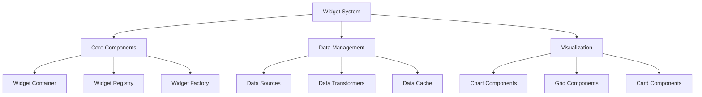

# Widget Interface Implementation

## Overview

This document details the shared widget components and interfaces used across both user and admin dashboards. The widget system provides a consistent, extensible framework for displaying and managing dashboard components.

## Widget Architecture



## Core Components

### Widget Container

```typescript
interface WidgetContainerProps {
  widget: BaseWidget;
  children: React.ReactNode;
  onResize?: (size: Size) => void;
  onMove?: (position: Position) => void;
  onSettings?: () => void;
  onRemove?: () => void;
}

const WidgetContainer: React.FC<WidgetContainerProps> = () => {
  // Implementation using react-grid-layout
};

// Widget Header
interface WidgetHeaderProps {
  title: string;
  icon?: React.ReactNode;
  actions?: WidgetAction[];
  loading?: boolean;
}

const WidgetHeader: React.FC<WidgetHeaderProps> = () => {
  // Implementation
};
```

### Widget Registry

```typescript
interface WidgetDefinition {
  type: string;
  component: React.ComponentType<any>;
  defaultConfig: Partial<BaseWidget>;
  configComponent?: React.ComponentType<any>;
  permissions?: Permission[];
}

class WidgetRegistry {
  // Registration
  registerWidget(type: string, definition: WidgetDefinition): void
  unregisterWidget(type: string): void

  // Retrieval
  getWidget(type: string): WidgetDefinition | undefined
  listWidgets(): WidgetDefinition[]

  // Validation
  validateConfig(type: string, config: unknown): ValidationResult
}
```

## Data Management

### Data Sources

```typescript
interface DataSource<T = unknown> {
  type: string;
  fetch(): Promise<T>;
  subscribe?(callback: (data: T) => void): () => void;
}

// API Data Source
class APIDataSource implements DataSource {
  constructor(private config: {
    endpoint: string;
    method?: string;
    params?: Record<string, unknown>;
    headers?: Record<string, string>;
  }) {}

  async fetch<T>(): Promise<T> {
    // Implementation
  }
}

// WebSocket Data Source
class WebSocketDataSource implements DataSource {
  constructor(private config: {
    url: string;
    channel: string;
    events: string[];
  }) {}

  subscribe<T>(callback: (data: T) => void): () => void {
    // Implementation
  }
}
```

### Data Transformers

```typescript
interface DataTransformer<TInput = unknown, TOutput = unknown> {
  transform(data: TInput): TOutput;
}

// Aggregation Transformer
class AggregationTransformer implements DataTransformer<number[], number> {
  constructor(private method: 'sum' | 'avg' | 'min' | 'max') {}

  transform(data: number[]): number {
    // Implementation
  }
}

// Time Series Transformer
class TimeSeriesTransformer implements DataTransformer<DataPoint[], ChartData> {
  constructor(private config: {
    interval: string;
    aggregation: string;
  }) {}

  transform(data: DataPoint[]): ChartData {
    // Implementation
  }
}
```

## Visualization Components

### Chart Components

```typescript
// Line Chart
interface LineChartProps {
  data: ChartData;
  options?: {
    axes?: AxesConfig;
    legend?: LegendConfig;
    tooltip?: TooltipConfig;
    animation?: AnimationConfig;
  };
}

const LineChart: React.FC<LineChartProps> = () => {
  // Implementation using recharts
};

// Gauge Chart
interface GaugeChartProps {
  value: number;
  min?: number;
  max?: number;
  thresholds?: {
    warning: number;
    critical: number;
  };
}

const GaugeChart: React.FC<GaugeChartProps> = () => {
  // Implementation
};
```

### Grid Components

```typescript
// Data Grid
interface DataGridProps<T> {
  data: T[];
  columns: GridColumn<T>[];
  sorting?: SortConfig;
  pagination?: PaginationConfig;
}

const DataGrid = <T,>({ data, columns, sorting, pagination }: DataGridProps<T>) => {
  // Implementation using @tanstack/react-table
};

// Card Grid
interface CardGridProps<T> {
  items: T[];
  renderCard: (item: T) => React.ReactNode;
  cols?: number;
  gap?: number;
}

const CardGrid = <T,>({ items, renderCard, cols, gap }: CardGridProps<T>) => {
  // Implementation
};
```

### Card Components

```typescript
// Metric Card
interface MetricCardProps {
  title: string;
  value: number;
  format?: string;
  trend?: {
    value: number;
    direction: 'up' | 'down';
  };
}

const MetricCard: React.FC<MetricCardProps> = () => {
  // Implementation
};

// Status Card
interface StatusCardProps {
  title: string;
  status: 'success' | 'warning' | 'error';
  message: string;
  icon?: React.ReactNode;
}

const StatusCard: React.FC<StatusCardProps> = () => {
  // Implementation
};
```

## Widget Configuration

### Config Components

```typescript
// Widget Settings Form
interface WidgetSettingsProps {
  widget: BaseWidget;
  onSave: (updates: Partial<BaseWidget>) => Promise<void>;
}

const WidgetSettings: React.FC<WidgetSettingsProps> = () => {
  // Implementation
};

// Data Source Config
interface DataSourceConfigProps {
  config: DataSourceConfig;
  onChange: (config: DataSourceConfig) => void;
}

const DataSourceConfig: React.FC<DataSourceConfigProps> = () => {
  // Implementation
};
```

### Layout Management

```typescript
// Grid Layout
interface GridLayoutProps {
  widgets: BaseWidget[];
  onLayoutChange: (widgets: BaseWidget[]) => void;
  cols?: number;
  rowHeight?: number;
}

const GridLayout: React.FC<GridLayoutProps> = () => {
  // Implementation using react-grid-layout
};

// Widget Resizer
interface WidgetResizerProps {
  children: React.ReactNode;
  onResize: (size: Size) => void;
  aspectRatio?: number;
}

const WidgetResizer: React.FC<WidgetResizerProps> = () => {
  // Implementation
};
```

## Performance Optimizations

### Data Caching

```typescript
interface CacheConfig {
  ttl: number;
  maxSize?: number;
  updateInterval?: number;
}

class WidgetDataCache {
  constructor(private config: CacheConfig) {}

  async get<T>(key: string): Promise<T | undefined> {
    // Implementation
  }

  async set<T>(key: string, value: T): Promise<void> {
    // Implementation
  }

  async invalidate(key: string): Promise<void> {
    // Implementation
  }
}
```

### Rendering Optimization

```typescript
// Lazy Widget
const LazyWidget = React.lazy(() => import('./Widget'));

interface LazyWidgetProps {
  widget: BaseWidget;
  fallback?: React.ReactNode;
}

const LazyWidgetLoader: React.FC<LazyWidgetProps> = () => {
  // Implementation
};

// Memoized Components
const MemoizedChart = React.memo(({ data, options }) => {
  // Implementation
});
```

## Error Handling

### Error Boundaries

```typescript
// Widget Error Boundary
interface WidgetErrorBoundaryProps {
  widget: BaseWidget;
  onError?: (error: Error) => void;
  children: React.ReactNode;
}

class WidgetErrorBoundary extends React.Component<WidgetErrorBoundaryProps> {
  // Implementation
}

// Error Display
interface ErrorDisplayProps {
  error: Error;
  widget: BaseWidget;
  onRetry?: () => void;
}

const ErrorDisplay: React.FC<ErrorDisplayProps> = () => {
  // Implementation
};
```

## Testing Utilities

### Widget Testing

```typescript
// Widget Test Wrapper
interface WidgetTestWrapperProps {
  widget: BaseWidget;
  mockData?: unknown;
  children: React.ReactNode;
}

const WidgetTestWrapper: React.FC<WidgetTestWrapperProps> = () => {
  // Implementation
};

// Mock Data Source
class MockDataSource implements DataSource {
  constructor(private data: unknown) {}

  async fetch<T>(): Promise<T> {
    // Implementation
  }
}
```

### Visual Testing

```typescript
// Widget Story
interface WidgetStoryProps {
  widget: BaseWidget;
  decorators?: StoryDecorator[];
}

const WidgetStory: React.FC<WidgetStoryProps> = () => {
  // Implementation for Storybook
};

// Widget Snapshot
interface WidgetSnapshotProps {
  widget: BaseWidget;
  viewport?: Viewport;
}

const WidgetSnapshot: React.FC<WidgetSnapshotProps> = () => {
  // Implementation for visual regression testing
};
