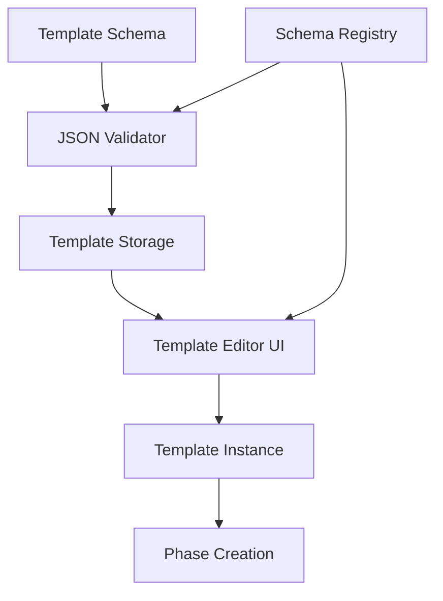

# Option 1: Database-Driven Templates with JSON Schema

## Overview

This approach stores templates as structured JSON in the database, allowing for maximum flexibility and dynamic template creation. It leverages JSON Schema for validation and provides a rich UI for template management.

## Architecture



## Implementation Steps

### 1. Define JSON Schema for Templates

Create a comprehensive JSON Schema that defines the structure of templates.

```typescript
// lib/pov/templates/schema.ts
export const templateSchema = {
  $schema: "http://json-schema.org/draft-07/schema#",
  type: "object",
  required: ["id", "name", "type", "stages"],
  properties: {
    id: {
      type: "string",
      description: "Unique identifier for the template"
    },
    name: {
      type: "string",
      description: "Display name for the template"
    },
    description: {
      type: "string",
      description: "Detailed description of the template"
    },
    type: {
      type: "string",
      enum: ["PLANNING", "EXECUTION", "REVIEW"],
      description: "Type of phase this template is for"
    },
    version: {
      type: "string",
      description: "Version of the template (semver format)"
    },
    stages: {
      type: "array",
      description: "Stages in the template",
      items: {
        type: "object",
        required: ["name", "tasks"],
        properties: {
          name: {
            type: "string",
            description: "Name of the stage"
          },
          description: {
            type: "string",
            description: "Description of the stage"
          },
          status: {
            type: "string",
            enum: ["PENDING", "ACTIVE", "COMPLETED", "BLOCKED"],
            default: "PENDING",
            description: "Initial status of the stage"
          },
          order: {
            type: "integer",
            minimum: 0,
            description: "Order of the stage in the sequence"
          },
          dependencies: {
            type: "array",
            items: {
              type: "string"
            },
            description: "IDs of stages that must be completed before this one"
          },
          tasks: {
            type: "array",
            description: "Tasks in the stage",
            items: {
              type: "object",
              required: ["key", "title"],
              properties: {
                key: {
                  type: "string",
                  description: "Unique key for the task within the template"
                },
                title: {
                  type: "string",
                  description: "Title of the task"
                },
                description: {
                  type: "string",
                  description: "Description of the task"
                },
                required: {
                  type: "boolean",
                  default: false,
                  description: "Whether the task is required for completion"
                },
                priority: {
                  type: "string",
                  enum: ["HIGH", "MEDIUM", "LOW"],
                  default: "MEDIUM",
                  description: "Priority level of the task"
                },
                dependencies: {
                  type: "array",
                  items: {
                    type: "string"
                  },
                  description: "Keys of tasks that must be completed before this one"
                },
                estimatedDuration: {
                  type: "object",
                  properties: {
                    value: {
                      type: "number",
                      minimum: 0
                    },
                    unit: {
                      type: "string",
                      enum: ["MINUTES", "HOURS", "DAYS", "WEEKS"]
                    }
                  },
                  description: "Estimated time to complete the task"
                }
              }
            }
          }
        }
      }
    },
    validationRules: {
      type: "array",
      description: "Rules for validating the template",
      items: {
        type: "object",
        required: ["type", "condition"],
        properties: {
          type: {
            type: "string",
            enum: ["DEPENDENCY", "TIMELINE", "REQUIRED_TASKS", "CUSTOM"],
            description: "Type of validation rule"
          },
          condition: {
            type: "string",
            description: "Condition expression for the rule"
          },
          errorMessage: {
            type: "string",
            description: "Error message to display when validation fails"
          }
        }
      }
    },
    timelineRecommendations: {
      type: "object",
      description: "Recommendations for timeline planning",
      properties: {
        minimumDuration: {
          type: "object",
          properties: {
            value: {
              type: "number",
              minimum: 0
            },
            unit: {
              type: "string",
              enum: ["DAYS", "WEEKS", "MONTHS"]
            }
          }
        },
        maximumDuration: {
          type: "object",
          properties: {
            value: {
              type: "number",
              minimum: 0
            },
            unit: {
              type: "string",
              enum: ["DAYS", "WEEKS", "MONTHS"]
            }
          }
        },
        stageDurations: {
          type: "object",
          additionalProperties: {
            type: "object",
            properties: {
              value: {
                type: "number",
                minimum: 0
              },
              unit: {
                type: "string",
                enum: ["DAYS", "WEEKS", "MONTHS"]
              }
            }
          }
        }
      }
    },
    metadata: {
      type: "object",
      description: "Additional metadata for the template"
    }
  }
};

export const stageSchema = {
  $schema: "http://json-schema.org/draft-07/schema#",
  type: "object",
  required: ["name", "tasks"],
  properties: templateSchema.properties.stages.items.properties
};

export const taskSchema = {
  $schema: "http://json-schema.org/draft-07/schema#",
  type: "object",
  required: ["key", "title"],
  properties: templateSchema.properties.stages.items.properties.tasks.items.properties
};
```

### 2. Implement JSON Schema Validator

Create a service to validate templates against the JSON Schema.

```typescript
// lib/pov/templates/validator.ts
import Ajv from 'ajv';
import addFormats from 'ajv-formats';
import { templateSchema, stageSchema, taskSchema } from './schema';

export class SchemaValidator {
  private static instance: SchemaValidator;
  private ajv: Ajv;
  private validators: {
    template: ReturnType<Ajv['compile']>;
    stage: ReturnType<Ajv['compile']>;
    task: ReturnType<Ajv['compile']>;
  };

  private constructor() {
    this.ajv = new Ajv({ allErrors: true });
    addFormats(this.ajv);
    
    this.validators = {
      template: this.ajv.compile(templateSchema),
      stage: this.ajv.compile(stageSchema),
      task: this.ajv.compile(taskSchema)
    };
  }

  public static getInstance(): SchemaValidator {
    if (!SchemaValidator.instance) {
      SchemaValidator.instance = new SchemaValidator();
    }
    return SchemaValidator.instance;
  }

  /**
   * Validate a template against the schema
   */
  public validateTemplate(template: any): { valid: boolean; errors: any[] } {
    const valid = this.validators.template(template);
    return {
      valid: !!valid,
      errors: this.validators.template.errors || []
    };
  }

  /**
   * Validate a stage against the schema
   */
  public validateStage(stage: any): { valid: boolean; errors: any[] } {
    const valid = this.validators.stage(stage);
    return {
      valid: !!valid,
      errors: this.validators.stage.errors || []
    };
  }

  /**
   * Validate a task against the schema
   */
  public validateTask(task: any): { valid: boolean; errors: any[] } {
    const valid = this.validators.task(task);
    return {
      valid: !!valid,
      errors: this.validators.task.errors || []
    };
  }

  /**
   * Format validation errors into human-readable messages
   */
  public formatErrors(errors: any[]): string[] {
    return errors.map(error => {
      const path = error.instancePath || '';
      const property = error.params.missingProperty ? 
        `/${error.params.missingProperty}` : '';
      
      switch (error.keyword) {
        case 'required':
          return `Missing required property: ${error.params.missingProperty}`;
        case 'enum':
          return `${path}${property} must be one of: ${error.params.allowedValues.join(', ')}`;
        case 'type':
          return `${path}${property} must be a ${error.params.type}`;
        default:
          return `${path}${property} ${error.message}`;
      }
    });
  }
}

export const schemaValidator = SchemaValidator.getInstance();
```

### 3. Create Template Storage Service

Implement a service to store and retrieve templates from the database.

```typescript
// lib/pov/templates/storage.ts
import { prisma } from '@/lib/prisma';
import { schemaValidator } from './validator';

export class TemplateStorageService {
  private static instance: TemplateStorageService;

  private constructor() {}

  public static getInstance(): TemplateStorageService {
    if (!TemplateStorageService.instance) {
      TemplateStorageService.instance = new TemplateStorageService();
    }
    return TemplateStorageService.instance;
  }

  /**
   * Get all templates
   */
  public async getAllTemplates(): Promise<any[]> {
    const templates = await prisma.phaseTemplate.findMany();
    return templates.map(template => ({
      ...template,
      workflow: template.workflow || {}
    }));
  }

  /**
   * Get templates by type
   */
  public async getTemplatesByType(type: string): Promise<any[]> {
    const templates = await prisma.phaseTemplate.findMany({
      where: { type }
    });
    return templates.map(template => ({
      ...template,
      workflow: template.workflow || {}
    }));
  }

  /**
   * Get a template by ID
   */
  public async getTemplate(id: string): Promise<any | null> {
    const template = await prisma.phaseTemplate.findUnique({
      where: { id }
    });
    
    if (!template) {
      return null;
    }
    
    return {
      ...template,
      workflow: template.workflow || {}
    };
  }

  /**
   * Save a template
   */
  public async saveTemplate(template: any): Promise<any> {
    // Validate template against schema
    const validation = schemaValidator.validateTemplate(template);
    
    if (!validation.valid) {
      const errors = schemaValidator.formatErrors(validation.errors);
      throw new Error(`Invalid template: ${errors.join(', ')}`);
    }
    
    // Check if template exists
    const existingTemplate = await prisma.phaseTemplate.findUnique({
      where: { id: template.id }
    });
    
    if (existingTemplate) {
      // Update existing template
      return prisma.phaseTemplate.update({
        where: { id: template.id },
        data: {
          name: template.name,
          description: template.description,
          type: template.type,
          workflow: template as any,
          updatedAt: new Date()
        }
      });
    } else {
      // Create new template
      return prisma.phaseTemplate.create({
        data: {
          id: template.id,
          name: template.name,
          description: template.description || '',
          type: template.type,
          workflow: template as any
        }
      });
    }
  }

  /**
   * Delete a template
   */
  public async deleteTemplate(id: string): Promise<boolean> {
    try {
      await prisma.phaseTemplate.delete({
        where: { id }
      });
      return true;
    } catch (error) {
      console.error('Failed to delete template:', error);
      return false;
    }
  }

  /**
   * Create a phase from a template
   */
  public async createPhaseFromTemplate(
    templateId: string,
    povId: string,
    data: {
      name?: string;
      description?: string;
      startDate: Date;
      endDate: Date;
      order: number;
    }
  ): Promise<any> {
    // Get the template
    const template = await this.getTemplate(templateId);
    
    if (!template) {
      throw new Error(`Template with ID ${templateId} not found`);
    }
    
    // Create the phase
    const phase = await prisma.phase.create({
      data: {
        povId,
        templateId,
        name: data.name || template.name,
        description: data.description || template.description,
        startDate: data.startDate,
        endDate: data.endDate,
        order: data.order,
        type: template.type,
        details: {
          tasks: [],
          metadata: template.metadata || {}
        } as any
      }
    });
    
    // Create stages from template
    const stages = template.workflow.stages || [];
    
    for (let i = 0; i < stages.length; i++) {
      const stageConfig = stages[i];
      
      // Create the stage
      const stage = await prisma.stage.create({
        data: {
          phaseId: phase.id,
          name: stageConfig.name,
          description: stageConfig.description,
          order: stageConfig.order || i,
          status: stageConfig.status || 'PENDING',
          metadata: stageConfig.metadata || {}
        }
      });
      
      // Create tasks for the stage
      const tasks = stageConfig.tasks || [];
      
      for (let j = 0; j < tasks.length; j++) {
        const taskConfig = tasks[j];
        
        await prisma.task.create({
          data: {
            stageId: stage.id,
            phaseId: phase.id,
            povId,
            title: taskConfig.title,
            description: taskConfig.description,
            order: j,
            status: 'OPEN',
            priority: taskConfig.priority || 'MEDIUM',
            metadata: {
              ...taskConfig.metadata,
              required: taskConfig.required,
              key: taskConfig.key,
              dependencies: taskConfig.dependencies
            }
          }
        });
      }
    }
    
    // Return the created phase with stages and tasks
    return prisma.phase.findUnique({
      where: { id: phase.id },
      include: {
        stages: {
          include: {
            tasks: true
          },
          orderBy: {
            order: 'asc'
          }
        }
      }
    });
  }
}

export const templateStorage = TemplateStorageService.getInstance();
```

### 4. Implement Schema Registry

Create a registry for managing custom schema extensions.

```typescript
// lib/pov/templates/schema-registry.ts
import { prisma } from '@/lib/prisma';

export class SchemaRegistry {
  private static instance: SchemaRegistry;
  private customSchemas: Map<string, any> = new Map();

  private constructor() {}

  public static getInstance(): SchemaRegistry {
    if (!SchemaRegistry.instance) {
      SchemaRegistry.instance = new SchemaRegistry();
    }
    return SchemaRegistry.instance;
  }

  /**
   * Initialize the registry with stored schemas
   */
  public async initialize(): Promise<void> {
    // Load custom schemas from database
    const schemas = await prisma.customSchema.findMany();
    
    schemas.forEach(schema => {
      this.customSchemas.set(schema.id, schema.schema);
    });
  }

  /**
   * Register a custom schema
   */
  public async registerSchema(id: string, schema: any): Promise<void> {
    // Validate schema structure
    if (!schema.$schema || !schema.type) {
      throw new Error('Invalid schema format');
    }
    
    // Save to database
    await prisma.customSchema.upsert({
      where: { id },
      update: { schema: schema as any },
      create: {
        id,
        name: schema.title || id,
        schema: schema as any
      }
    });
    
    // Update in-memory cache
    this.customSchemas.set(id, schema);
  }

  /**
   * Get a schema by ID
   */
  public getSchema(id: string): any | undefined {
    return this.customSchemas.get(id);
  }

  /**
   * Get all registered schemas
   */
  public getAllSchemas(): Map<string, any> {
    return new Map(this.customSchemas);
  }

  /**
   * Remove a schema
   */
  public async removeSchema(id: string): Promise<boolean> {
    try {
      await prisma.customSchema.delete({
        where: { id }
      });
      
      this.customSchemas.delete(id);
      return true;
    } catch (error) {
      console.error('Failed to remove schema:', error);
      return false;
    }
  }

  /**
   * Extend the base template schema with custom properties
   */
  public extendTemplateSchema(baseSchema: any, extensions: any[]): any {
    const extendedSchema = { ...baseSchema };
    
    extensions.forEach(extension => {
      // Merge properties
      if (extension.properties) {
        extendedSchema.properties = {
          ...extendedSchema.properties,
          ...extension.properties
        };
      }
      
      // Merge required fields
      if (extension.required && Array.isArray(extension.required)) {
        extendedSchema.required = [
          ...new Set([...extendedSchema.required, ...extension.required])
        ];
      }
    });
    
    return extendedSchema;
  }
}

export const schemaRegistry = SchemaRegistry.getInstance();
```

### 5. Create Template Editor UI Components

Implement UI components for creating and editing templates.

```typescript
// components/admin/JsonSchemaForm.tsx
'use client';

import { useState, useEffect } from 'react';
import { Button } from '@/components/ui/Button';
import { Card, CardContent, CardHeader, CardTitle } from '@/components/ui/Card';
import { Tabs, TabsContent, TabsList, TabsTrigger } from '@/components/ui/Tabs';
import { toast } from '@/components/ui/useToast';
import dynamic from 'next/dynamic';

// Dynamically import the JSON editor to avoid SSR issues
const JsonEditor = dynamic(() => import('@/components/ui/JsonEditor'), {
  ssr: false,
  loading: () => <div className="h-96 w-full bg-muted animate-pulse rounded-md" />
});

interface JsonSchemaFormProps {
  initialValue?: any;
  schema: any;
  onSubmit: (data: any) => Promise<void>;
  onCancel?: () => void;
}

export default function JsonSchemaForm({
  initialValue,
  schema,
  onSubmit,
  onCancel
}: JsonSchemaFormProps) {
  const [value, setValue] = useState<any>(initialValue || {});
  const [errors, setErrors] = useState<string[]>([]);
  const [loading, setLoading] = useState(false);
  const [activeTab, setActiveTab] = useState<string>('visual');
  
  // Initialize with default values based on schema
  useEffect(() => {
    if (!initialValue) {
      const defaultValue = generateDefaultValue(schema);
      setValue(defaultValue);
    }
  }, [schema, initialValue]);
  
  // Generate default values based on schema
  const generateDefaultValue = (schema: any): any => {
    if (!schema || !schema.properties) {
      return {};
    }
    
    const result: any = {};
    
    // Add required properties with default values
    if (schema.required && Array.isArray(schema.required)) {
      schema.required.forEach((prop: string) => {
        const property = schema.properties[prop];
        
        if (property) {
          if (property.default !== undefined) {
            result[prop] = property.default;
          } else if (property.type === 'string') {
            result[prop] = '';
          } else if (property.type === 'number' || property.type === 'integer') {
            result[prop] = 0;
          } else if (property.type === 'boolean') {
            result[prop] = false;
          } else if (property.type === 'array') {
            result[prop] = [];
          } else if (property.type === 'object') {
            result[prop] = generateDefaultValue(property);
          }
        }
      });
    }
    
    return result;
  };
  
  // Validate the form data against the schema
  const validateForm = async (): Promise<boolean> => {
    try {
      const response = await fetch('/api/templates/validate', {
        method: 'POST',
        headers: {
          'Content-Type': 'application/json',
        },
        body: JSON.stringify({
          schema,
          data: value
        }),
      });
      
      const result = await response.json();
      
      if (!result.valid) {
        setErrors(result.errors);
        return false;
      }
      
      setErrors([]);
      return true;
    } catch (error) {
      console.error('Validation error:', error);
      setErrors(['Failed to validate form']);
      return false;
    }
  };
  
  // Handle form submission
  const handleSubmit = async () => {
    try {
      setLoading(true);
      
      // Validate form
      const isValid = await validateForm();
      
      if (!isValid) {
        toast({
          title: 'Validation Error',
          description: 'Please fix the errors before submitting',
          variant: 'destructive',
        });
        return;
      }
      
      // Submit form
      await onSubmit(value);
      
      toast({
        title: 'Success',
        description: 'Form submitted successfully',
      });
    } catch (error) {
      console.error('Submit error:', error);
      toast({
        title: 'Error',
        description: 'Failed to submit form',
        variant: 'destructive',
      });
    } finally {
      setLoading(false);
    }
  };
  
  return (
    <Card className="w-full">
      <CardHeader>
        <CardTitle>Template Editor</CardTitle>
      </CardHeader>
      <CardContent>
        <Tabs value={activeTab} onValueChange={setActiveTab}>
          <TabsList className="mb-4">
            <TabsTrigger value="visual">Visual Editor</TabsTrigger>
            <TabsTrigger value="json">JSON Editor</TabsTrigger>
          </TabsList>
          
          <TabsContent value="visual">
            <div className="text-center p-8">
              <p className="text-muted-foreground mb-4">
                Visual editor coming soon. Please use the JSON editor for now.
              </p>
              <Button onClick={() => setActiveTab('json')}>
                Switch to JSON Editor
              </Button>
            </div>
          </TabsContent>
          
          <TabsContent value="json">
            <div className="space-y-4">
              <JsonEditor
                value={value}
                onChange={setValue}
                height="400px"
              />
              
              {errors.length > 0 && (
                <div className="bg-destructive/10 p-4 rounded-md">
                  <h4 className="font-medium text-destructive mb-2">Validation Errors</h4>
                  <ul className="list-disc pl-5 space-y-1">
                    {errors.map((error, index) => (
                      <li key={index} className="text-sm text-destructive">
                        {error}
                      </li>
                    ))}
                  </ul>
                </div>
              )}
              
              <div className="flex justify-end space-x-2">
                {onCancel && (
                  <Button variant="outline" onClick={onCancel} disabled={loading}>
                    Cancel
                  </Button>
                )}
                <Button onClick={handleSubmit} disabled={loading}>
                  {loading ? 'Saving...' : 'Save Template'}
                </Button>
              </div>
            </div>
          </TabsContent>
        </Tabs>
      </CardContent>
    </Card>
  );
}
```

```typescript
// components/ui/JsonEditor.tsx
'use client';

import { useRef, useEffect } from 'react';
import { editor } from 'monaco-editor';

interface JsonEditorProps {
  value: any;
  onChange: (value: any) => void;
  height?: string;
}

export default function JsonEditor({ value, onChange, height = '300px' }: JsonEditorProps) {
  const editorRef = useRef<editor.IStandaloneCodeEditor | null>(null);
  const containerRef = useRef<HTMLDivElement>(null);
  
  useEffect(() => {
    if (!containerRef.current) return;
    
    // Initialize editor
    editorRef.current = editor.create(containerRef.current, {
      value: JSON.stringify(value, null, 2),
      language: 'json',
      automaticLayout: true,
      minimap: { enabled: false },
      scrollBeyondLastLine: false,
      lineNumbers: 'on',
      roundedSelection: true,
      theme: 'vs-dark',
    });
    
    // Handle changes
    editorRef.current.onDidChangeModelContent(() => {
      try {
        const editorValue = editorRef.current?.getValue() || '';
        const parsedValue = JSON.parse(editorValue);
        onChange(parsedValue);
      } catch (error) {
        // Ignore JSON parse errors while typing
      }
    });
    
    return () => {
      editorRef.current?.dispose();
    };
  }, []);
  
  // Update editor when value changes externally
  useEffect(() => {
    if (editorRef.current) {
      const currentValue = editorRef.current.getValue();
      const newValue = JSON.stringify(value, null, 2);
      
      if (currentValue !== newValue) {
        editorRef.current.setValue(newValue);
      }
    }
  }, [value]);
  
  return (
    <div 
      ref={containerRef} 
      style={{ height, width: '100%', border: '1px solid #ccc', borderRadius: '4px' }}
    />
  );
}
```

### 6. Create API Routes for Template Management

Implement API routes for template CRUD operations and validation.

```typescript
// app/api/templates/route.ts
import { NextRequest, NextResponse } from 'next/server';
import { getAuthUser } from '@/lib/auth/get-auth-user';
import { templateStorage } from '@/lib/pov/templates/storage';

export async function GET(request: NextRequest) {
  try {
    const user = await getAuthUser(request);
    if (!user) {
      return NextResponse.json({ error: 'Unauthorized' }, { status: 401 });
    }

    // Get query parameters
    const url = new URL(request.url);
    const type = url.searchParams.get('type');

    let templates;
    if (type) {
      templates = await templateStorage.getTemplatesByType(type);
    } else {
      templates = await templateStorage.getAllTemplates();
    }

    return NextResponse.json({ templates });
  } catch (error) {
    console.error('[Templates API Error]:', error);
    return NextResponse.json(
      { error: 'Failed to fetch templates' },
      { status: 500 }
    );
  }
}

export async function POST(request: NextRequest) {
  try {
    const user = await getAuthUser(request);
    if (!user) {
      return NextResponse.json({ error: 'Unauthorized' }, { status: 401 });
    }

    // Check if user has admin role
    if (user.role !== 'ADMIN' && user.role !== 'SUPER_ADMIN') {
      return NextResponse.json(
        { error: 'Insufficient permissions' },
        { status: 403 }
      );
    }

    const data = await request.json();
    
    // Generate ID if not provided
    if (!data.id) {
      data.id = `template-${Date.now()}`;
    }
    
    const template = await templateStorage.saveTemplate(data);

    return NextResponse.json({ template });
  } catch (error) {
    console.error('[Templates API Error]:', error);
    return NextResponse.json(
      { error: error instanceof Error ? error.message : 'Failed to create template' },
      { status: 500 }
    );
  }
}
```

```typescript
// app/api/templates/[id]/route.ts
import { NextRequest, NextResponse } from 'next/server';
import { getAuthUser } from '@/lib/auth/get-auth-user';
import { templateStorage } from '@/lib/pov/templates/storage';

export async function GET(
  request: NextRequest,
  { params }: { params: { id: string } }
) {
  try {
    const user = await getAuthUser(request);
    if (!user) {
      return NextResponse.json({ error: 'Unauthorized' }, { status: 401 });
    }

    const { id } = params;
    const template = await templateStorage.getTemplate(id);

    if (!template) {
      return NextResponse.json(
        { error: 'Template not found' },
        { status: 404 }
      );
    }

    return NextResponse.json({ template });
  } catch (error) {
    console.error('[Template API Error]:', error);
    return NextResponse.json(
      { error: 'Failed to fetch template' },
      { status: 500 }
    );
  }
}

export async function PUT(
  request: NextRequest,
  { params }: { params: { id: string } }
) {
  try {
    const user = await getAuthUser(request);
    if (!user) {
      return NextResponse.json({ error: 'Unauthorized' }, { status: 401 });
    }

    // Check if user has admin role
    if (user.role !== 'ADMIN' && user.role !== 'SUPER_ADMIN') {
      return NextResponse.json(
        { error: 'Insufficient permissions' },
        { status: 403 }
      );
    }

    const { id } = params;
    const data = await request.json();
    
    // Ensure ID in body matches URL parameter
    data.id = id;
    
    const template = await templateStorage.saveTemplate(data);

    return NextResponse.json({ template });
  } catch (error) {
    console.error('[Template API Error]:', error);
    return NextResponse.json(
      { error: error instanceof Error ? error.message : 'Failed to update template' },
      { status: 500 }
    );
