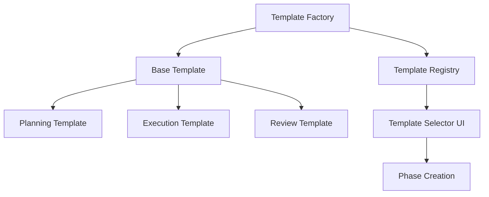

# Template Factory Implementation Plan

## Overview

This document outlines the phased implementation plan for a Code-Based Template Factory approach to manage phase templates in the POV platform. This approach provides a balance of type safety, performance, and flexibility while allowing for future extensibility.

## Architecture

## Implementation Phases

### [Phase 1: Core Template Types and Factory](./phase1-core.md)

**Focus**: Establish the foundation with core interfaces and a basic factory implementation.

**Key Components**:
- Template interfaces and type definitions
- Basic Template Factory with default templates
- Integration with existing phase service

**Benefits**:
- Provides immediate value with predefined templates
- Establishes type safety and structure
- Minimal changes to existing code

### [Phase 2: Template Registry and Persistence](./phase2-registry.md)

**Focus**: Add the ability to store and retrieve templates from the database.

**Key Components**:
- Template Registry service to bridge code and database templates
- Database persistence layer
- API endpoints for template CRUD operations

**Benefits**:
- Templates can be saved and reused
- Admins can create custom templates
- Maintains backward compatibility with Phase 1

### [Phase 3: UI Components and User Experience](./phase3-ui.md)

**Focus**: Create the user interface for template selection and management.

**Key Components**:
- Template selector component
- Template preview component
- Template editor for admins
- Integration with phase creation flow

**Benefits**:
- Intuitive template selection experience
- Visual preview of templates before selection
- Admin tools for template management

### [Phase 4: Advanced Features and Extensibility](./phase4-advanced.md)

**Focus**: Add advanced features and prepare for future extensibility.

**Key Components**:
- Template versioning
- Template inheritance and composition
- Custom field support
- Template analytics (usage tracking)

**Benefits**:
- Support for more complex template scenarios
- Foundation for future template marketplace
- Data-driven template improvements

## Implementation Timeline

| Phase | Estimated Duration | Dependencies |
|-------|-------------------|--------------|
| Phase 1 | 1-2 weeks | None |
| Phase 2 | 1-2 weeks | Phase 1 |
| Phase 3 | 2-3 weeks | Phase 2 |
| Phase 4 | 2-4 weeks | Phase 3 |

## Success Criteria

- Templates can be created, saved, and reused
- Phase creation process is simplified through templates
- Admin users can manage templates
- Templates support all required phase types and configurations
- System is extensible for future requirements
