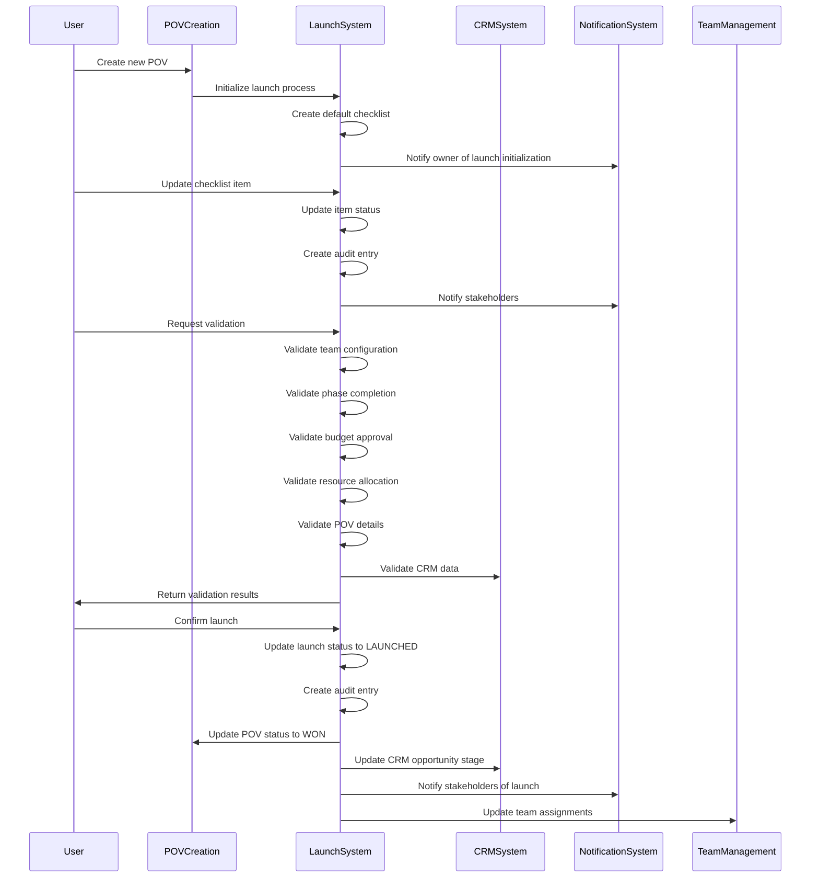

# Launch Validation System Integration

This document details how the Launch Validation System integrates with other key systems, particularly POV Creation and CRM Integration.

## Integration with POV Creation

### Current State

Currently, there is no direct integration between POV creation and the launch validation system. When a POV is created, no launch record is automatically created, and the launch process must be manually initiated later.

### Enhanced Integration

The enhanced implementation will integrate the launch validation system with POV creation as follows:

#### Automatic Launch Initialization

```typescript
// lib/pov/handlers/post.ts
export async function createPoVHandler(
  request: NextRequest,
  { params }: { params: { povId?: string } }
) {
  // ... existing code for POV creation

  // Create POV
  const pov = await povService.create({
    // ... POV data
  });

  // Initialize launch process with default checklist
  await launchService.initiateLaunch(pov.id);

  // Return the POV data
  return pov;
}
```

This integration ensures that every new POV automatically has a launch record created with a default checklist, setting the launch status to `NOT_INITIATED`.

#### Launch Queue for Managers

A new dashboard will be created for managers to view POVs that are ready for launch review:

```tsx
// app/(authenticated)/admin/launch/queue/page.tsx
export default function LaunchQueuePage() {
  const { data: queue, isLoading, error } = useQuery({
    queryKey: ["launch-queue"],
    queryFn: () => fetch('/api/admin/launch/queue').then(res => res.json()),
  });

  // ... UI implementation
}
```

This dashboard will show:
- POVs with launch status `NOT_INITIATED` or `IN_PROGRESS`
- Checklist completion percentage
- Validation status
- Quick actions for managers

#### Launch Request Workflow

The enhanced system will implement a formal launch request workflow:

1. **POV Owner**: Completes initial checklist items and requests launch review
2. **Manager**: Reviews the POV and checklist, delegates tasks if needed
3. **Team Members**: Complete assigned checklist items
4. **Manager**: Performs final validation and confirms launch

This workflow will be supported by:
- Status transitions
- Notifications
- Audit trail
- Role-based permissions

## Integration with CRM System

### Current State

Currently, there is no direct integration between the CRM system and the launch validation process. The CRM integration is limited to syncing basic POV data with external CRM systems.

### Enhanced Integration

The enhanced implementation will integrate the launch validation system with the CRM system as follows:

#### CRM Validation in Launch Process

```typescript
// lib/pov/services/validation.ts
class ValidationService {
  // ... existing code

  // Validate CRM data
  async validateCRM(povId: string): Promise<ValidationResult> {
    return await crmService.validateForLaunch(povId);
  }
}

// lib/pov/services/crm.ts
class CRMService {
  // ... existing code

  // Validate CRM data for launch
  async validateForLaunch(povId: string): Promise<ValidationResult> {
    const pov = await povService.get(povId);
    if (!pov) {
      throw new Error('POV not found');
    }

    const errors: ValidationError[] = [];
    const warnings: ValidationError[] = [];

    // Check if CRM sync is up to date
    if (!pov.lastCrmSync || isOlderThan(pov.lastCrmSync, 24)) {
      errors.push({
        code: 'CRM_SYNC_OUTDATED',
        message: 'CRM data is outdated. Please sync before launch.',
        severity: 'ERROR',
        category: 'crm'
      });
    }

    // Check if required CRM fields are present
    if (!pov.dealId) {
      errors.push({
        code: 'CRM_DEAL_ID_MISSING',
        message: 'CRM Deal ID is missing.',
        severity: 'ERROR',
        category: 'crm'
      });
    }

    // Check for warnings
    if (pov.crmSyncStatus === 'PARTIAL') {
      warnings.push({
        code: 'CRM_SYNC_PARTIAL',
        message: 'CRM sync was only partially successful.',
        severity: 'WARNING',
        category: 'crm'
      });
    }

    return {
      valid: errors.length === 0,
      errors,
      warnings
    };
  }
}
```

This integration ensures that CRM data is validated as part of the launch process, checking for:
- Up-to-date CRM sync
- Required CRM fields
- CRM sync status

#### CRM Updates After Launch

```typescript
// lib/pov/services/launch.ts
class LaunchService {
  // ... existing code

  // Confirm launch
  async confirmLaunch(launchId: string, userId: string): Promise<void> {
    // ... existing code

    // Update CRM after launch
    const launch = await prisma.pOVLaunch.findUnique({
      where: { id: launchId },
      include: { pov: true }
    });

    if (launch) {
      await crmService.updateAfterLaunch(launch.pov.id);
    }
  }
}

// lib/pov/services/crm.ts
class CRMService {
  // ... existing code

  // Update CRM after launch
  async updateAfterLaunch(povId: string): Promise<void> {
    const pov = await povService.get(povId);
    if (!pov) {
      throw new Error('POV not found');
    }

    // Update CRM with launch status
    // This would be replaced with actual CRM API calls
    console.log(`Updating CRM after launch for POV ${povId}`);

    // Example: Update CRM opportunity stage
    await this.updateCRMField(povId, 'stage', 'Launched');

    // Example: Create CRM activity
    await this.createCRMActivity(povId, 'POV Launched', `POV "${pov.title}" was launched on ${new Date().toISOString()}`);

    // Update sync history
    await this.createSyncHistory(povId, 'SUCCESS', {
      action: 'launch_update',
      timestamp: new Date().toISOString()
    });
  }
}
```

This integration ensures that the CRM system is updated when a POV is launched, including:
- Updating CRM opportunity stage
- Creating CRM activities
- Tracking sync history

#### Bidirectional Status Updates

The enhanced system will implement bidirectional status updates between the POV system and CRM:

```typescript
// lib/pov/services/crm.ts
class CRMService {
  // ... existing code

  // Sync POV status with CRM
  async syncStatus(povId: string): Promise<void> {
    const pov = await povService.get(povId);
    if (!pov) {
      throw new Error('POV not found');
    }

    // Map POV status to CRM stage
    const crmStage = this.mapStatusToCRMStage(pov.status);

    // Update CRM stage
    await this.updateCRMField(povId, 'stage', crmStage);
  }

  // Map POV status to CRM stage
  private mapStatusToCRMStage(status: POVStatus): string {
    switch (status) {
      case 'PROJECTED':
        return 'Prospecting';
      case 'IN_PROGRESS':
        return 'POV In Progress';
      case 'VALIDATION':
        return 'POV Validation';
      case 'WON':
        return 'Closed Won';
      case 'LOST':
        return 'Closed Lost';
      default:
        return 'Unknown';
    }
  }

  // Update POV status from CRM
  async updateStatusFromCRM(povId: string): Promise<void> {
    const pov = await povService.get(povId);
    if (!pov) {
      throw new Error('POV not found');
    }

    // Get CRM stage
    const crmStage = await this.getCRMField(povId, 'stage');

    // Map CRM stage to POV status
    const povStatus = this.mapCRMStageToPOVStatus(crmStage);

    // Update POV status if different
    if (povStatus && povStatus !== pov.status) {
      await povService.update(povId, { status: povStatus });
    }
  }

  // Map CRM stage to POV status
  private mapCRMStageToPOVStatus(stage: string): POVStatus | null {
    switch (stage) {
      case 'Prospecting':
        return 'PROJECTED';
      case 'POV In Progress':
        return 'IN_PROGRESS';
      case 'POV Validation':
        return 'VALIDATION';
      case 'Closed Won':
        return 'WON';
      case 'Closed Lost':
        return 'LOST';
      default:
        return null;
    }
  }
}
```

This integration ensures that status changes are synchronized between the POV system and CRM, including:
- Mapping POV status to CRM stage
- Updating CRM when POV status changes
- Updating POV status when CRM stage changes

## Integration with Notification System

### Current State

Currently, there is no integration between the launch validation system and the notification system.

### Enhanced Integration

The enhanced implementation will integrate the launch validation system with the notification system as follows:

```typescript
// lib/pov/services/launch.ts
class LaunchService {
  // ... existing code

  // Send launch status notification
  async sendStatusNotification(
    povId: string,
    status: LaunchStatus,
    userId: string
  ): Promise<void> {
    const pov = await povService.get(povId);
    if (!pov) {
      throw new Error('POV not found');
    }

    // Notify POV owner
    await notificationService.create({
      userId: pov.ownerId,
      message: `POV "${pov.title}" launch status changed to ${status}`,
      type: status === 'LAUNCHED' ? 'success' : status === 'FAILED' ? 'error' : 'info',
      actionUrl: `/pov/${povId}/launch/status`
    });

    // Notify team members if team exists
    if (pov.teamId) {
      const teamMembers = await teamService.getTeamMembers(pov.teamId);
      for (const member of teamMembers) {
        if (member.userId !== pov.ownerId) {
          await notificationService.create({
            userId: member.userId,
            message: `POV "${pov.title}" launch status changed to ${status}`,
            type: status === 'LAUNCHED' ? 'success' : status === 'FAILED' ? 'error' : 'info',
            actionUrl: `/pov/${povId}/launch/status`
          });
        }
      }
    }
  }

  // Send checklist update notification
  async sendChecklistNotification(
    povId: string,
    itemKey: string,
    completed: boolean,
    userId: string
  ): Promise<void> {
    const pov = await povService.get(povId);
    if (!pov) {
      throw new Error('POV not found');
    }

    // Get checklist item label
    const launch = await this.getLaunchByPovId(povId);
    if (!launch) {
      throw new Error('Launch not found');
    }

    const checklist = launch.checklist as any;
    const item = checklist.items.find((i: any) => i.key === itemKey);
    if (!item) {
      throw new Error('Checklist item not found');
    }

    // Notify POV owner if not the updater
    if (pov.ownerId !== userId) {
      await notificationService.create({
        userId: pov.ownerId,
        message: `Checklist item "${item.label}" ${completed ? 'completed' : 'uncompleted'} for POV "${pov.title}"`,
        type: 'info',
        actionUrl: `/pov/${povId}/launch/checklist`
      });
    }
  }
}
```

This integration ensures that stakeholders are notified of launch-related events, including:
- Launch status changes
- Checklist updates
- Validation results
- Launch confirmations

## Integration with Team Management

### Current State

Currently, there is limited integration between the launch validation system and team management.

### Enhanced Integration

The enhanced implementation will integrate the launch validation system with team management as follows:

```typescript
// lib/pov/services/launch.ts
class LaunchService {
  // ... existing code

  // Delegate checklist item
  async delegateChecklistItem(
    povId: string,
    itemKey: string,
    assigneeId: string,
    delegatorId: string
  ): Promise<void> {
    const pov = await povService.get(povId);
    if (!pov) {
      throw new Error('POV not found');
    }

    // Get checklist item
    const launch = await this.getLaunchByPovId(povId);
    if (!launch) {
      throw new Error('Launch not found');
    }

    const checklist = launch.checklist as any;
    const item = checklist.items.find((i: any) => i.key === itemKey);
    if (!item) {
      throw new Error('Checklist item not found');
    }

    // Update checklist item with assignee
    const updatedItems = checklist.items.map((i: any) => {
      if (i.key === itemKey) {
        return {
          ...i,
          assigneeId,
          delegatedBy: delegatorId,
          delegatedAt: new Date().toISOString()
        };
      }
      return i;
    });

    // Update launch checklist
    await prisma.pOVLaunch.update({
      where: { id: launch.id },
      data: {
        checklist: { items: updatedItems } as unknown as Prisma.InputJsonValue
      }
    });

    // Create audit entry
    await this.createAudit(launch.id, delegatorId, 'checklist_delegation', {
      itemKey,
      itemLabel: item.label,
      assigneeId
    });

    // Notify assignee
    await notificationService.create({
      userId: assigneeId,
      message: `You have been assigned checklist item "${item.label}" for POV "${pov.title}"`,
      type: 'info',
      actionUrl: `/pov/${povId}/launch/checklist`
    });
  }

  // Get team member assignments
  async getTeamAssignments(povId: string): Promise<Record<string, string[]>> {
    const launch = await this.getLaunchByPovId(povId);
    if (!launch) {
      throw new Error('Launch not found');
    }

    const checklist = launch.checklist as any;
    const assignments: Record<string, string[]> = {};

    checklist.items.forEach((item: any) => {
      if (item.assigneeId) {
        if (!assignments[item.assigneeId]) {
          assignments[item.assigneeId] = [];
        }
        assignments[item.assigneeId].push(item.key);
      }
    });

    return assignments;
  }
}
```

This integration ensures that team members can be assigned to specific checklist items, including:
- Delegating checklist items to team members
- Tracking assignments
- Notifying assignees
- Auditing delegations

## Status Transition Integration

### POV Status and Launch Status Synchronization

The enhanced implementation will synchronize POV status and launch status as follows:

```typescript
// lib/pov/services/launch.ts
class LaunchService {
  // ... existing code

  // Update POV status based on launch status
  async updatePOVStatus(povId: string, launchStatus: LaunchStatus): Promise<void> {
    const pov = await povService.get(povId);
    if (!pov) {
      throw new Error('POV not found');
    }

    let povStatus: POVStatus | null = null;

    switch (launchStatus) {
      case 'NOT_INITIATED':
        // No change to POV status
        break;
      case 'IN_PROGRESS':
        povStatus = 'VALIDATION';
        break;
      case 'LAUNCHED':
        povStatus = 'WON';
        break;
      case 'FAILED':
        // Keep in VALIDATION status until issues are fixed
        povStatus = 'VALIDATION';
        break;
    }

    if (povStatus && povStatus !== pov.status) {
      await povService.update(povId, { status: povStatus });
    }
  }

  // Update launch status based on POV status
  async updateLaunchStatus(povId: string, povStatus: POVStatus): Promise<void> {
    const launch = await this.getLaunchByPovId(povId);
    if (!launch) {
      // No launch record yet, nothing to update
      return;
    }

    let launchStatus: LaunchStatus | null = null;

    switch (povStatus) {
      case 'PROJECTED':
      case 'IN_PROGRESS':
        // No change to launch status
        break;
      case 'VALIDATION':
        launchStatus = 'IN_PROGRESS';
        break;
      case 'WON':
        // Only update if not already launched
        if (launch.status !== 'LAUNCHED') {
          launchStatus = 'LAUNCHED';
        }
        break;
      case 'LOST':
        // Only update if not already failed
        if (launch.status !== 'FAILED') {
          launchStatus = 'FAILED';
        }
        break;
    }

    if (launchStatus && launchStatus !== launch.status) {
      await prisma.pOVLaunch.update({
        where: { id: launch.id },
        data: { status: launchStatus }
      });
    }
  }
}
```

This integration ensures that status changes are synchronized between the POV and launch systems, including:
- Updating POV status when launch status changes
- Updating launch status when POV status changes
- Maintaining consistency between the two systems

## Integration Flow Diagram



## Conclusion

The enhanced integration between the Launch Validation System, POV Creation, and CRM Integration provides a comprehensive solution for managing the POV launch process. By automating launch initialization, implementing bidirectional status updates, and providing robust validation, the system ensures that POVs are properly validated and approved before being launched.

Key benefits of this integration include:
- Streamlined launch process
- Improved data consistency
- Enhanced visibility into launch status
- Better coordination between teams
- Automated validation
- Comprehensive audit trail
