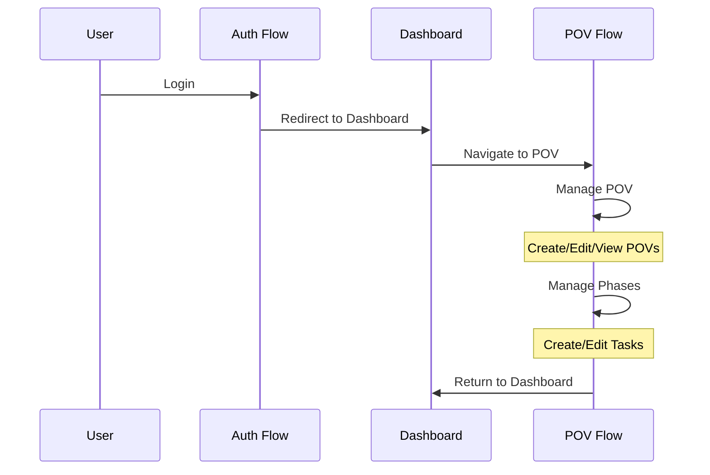

# Navigation Structure

## Route Groups and Components

```mermaid
graph TD
    subgraph "Route Groups"
        A[Root] --> Auth[Authentication]
        A --> Admin[Admin]
        A --> POV[POV Management]
        A --> Support[Support]
        
        Auth --> AL[/auth/login]
        Auth --> AR[/auth/register]
        Auth --> AFP[/auth/forgot-password]
        Auth --> ARP[/auth/reset-password]
        
        Admin --> AD[/admin/dashboard]
        Admin --> AU[/admin/users]
        Admin --> AR2[/admin/roles]
        Admin --> AP[/admin/permissions]
        Admin --> AA[/admin/audit]
        Admin --> CRM[/admin/crm/*]
        
        POV --> PL[/pov/list]
        POV --> PC[/pov/create]
        POV --> PD[/pov/:povId]
        PD --> PDP[/phases/*]
        PD --> PDK[/kpi/*]
        PD --> PDL[/launch/*]
        
        Support --> SF[/support/feature]
        Support --> SR[/support/request]
    end

    subgraph "Navigation Components"
        AN[AdminNav]
        MN[MobileNav]
        SN[SideNav]
    end

    subgraph "Layouts"
        AL2[AppLayout]
        ADL[AdminLayout]
        AUL[AuthLayout]
    end

    AN --> Admin
    MN --> Admin
    MN --> POV
    SN --> POV

    style Auth fill:#f9f,stroke:#333,stroke-width:2px
    style Admin fill:#bbf,stroke:#333,stroke-width:2px
    style POV fill:#bfb,stroke:#333,stroke-width:2px
    style Support fill:#fbb,stroke:#333,stroke-width:2px
```

## Navigation Flow Patterns



## Component Relationships

```mermaid
graph LR
    subgraph "Layout Components"
        AL[AppLayout]
        ADL[AdminLayout]
        AUL[AuthLayout]
    end
    
    subgraph "Navigation Components"
        AN[AdminNav]
        MN[MobileNav]
        SN[SideNav]
    end
    
    subgraph "Page Components"
        PV[POV Views]
        AV[Admin Views]
        UV[User Views]
    end
    
    AL --> AN
    AL --> MN
    ADL --> AN
    ADL --> SN
    AUL --> MN
    
    AN --> AV
    SN --> PV
    MN --> UV
