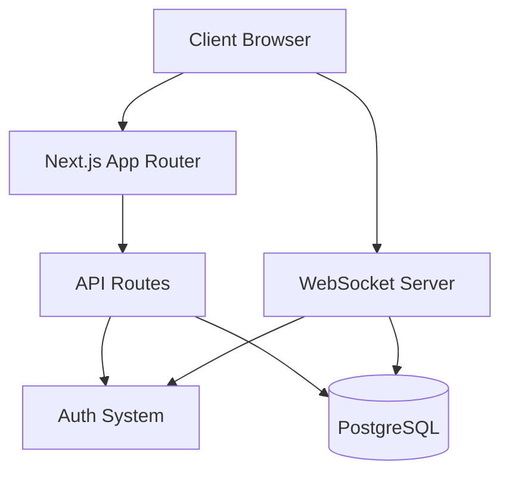
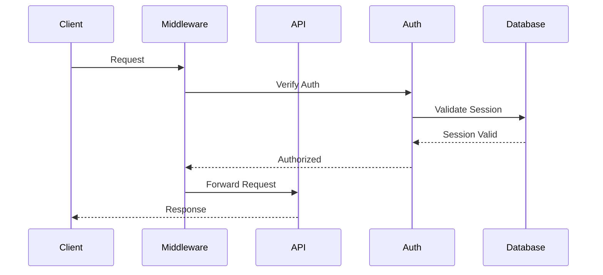
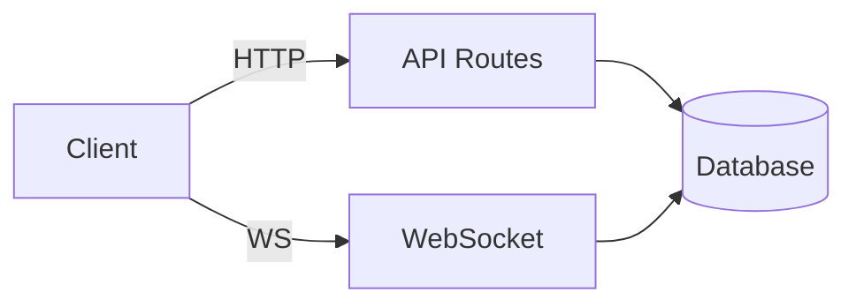
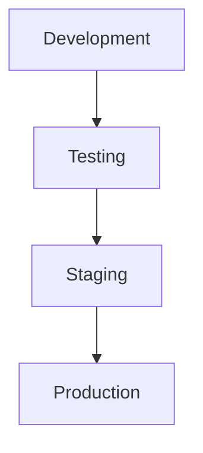

# System Architecture

## Overview
The PoV Manager is a Next.js-based web application that provides comprehensive proof-of-value trial management. The system is built with a focus on security, scalability, and maintainability.

## System Components

### 1. High-Level Architecture


## Core Subsystems

### 1. Authentication System
- JWT-based authentication with standardized handling
  ```typescript
  // Type-safe JWT payload
  interface TokenPayload {
    userId: string;      // Stored as 'sub' claim
    email: string;       // User's email
    role: UserRole;      // User's role
    exp?: number;        // Expiration time
    iat?: number;        // Issued at time
  }

  // Type-safe token verification
  interface VerifiedToken {
    payload: TokenPayload;
    protectedHeader: {
      alg: 'HS256';
      typ?: 'JWT';
    };
  }

  // Type-safe error handling
  interface TokenError {
    code: 'TOKEN_EXPIRED' | 'TOKEN_INVALID' | 'TOKEN_MISSING';
    message: string;
    details?: {
      expiredAt?: Date;
      invalidReason?: string;
    };
  }
  ```
- Role-based access control with team roles
  ```typescript
  // Type-safe role system
  interface UserWithRoles {
    id: string;
    role: UserRole;      // System role
    teamRoles: Array<{   // Team-specific roles
      teamId: string;
      role: TeamRole;
    }>;
  }
  ```
- Secure session management with refresh tokens
  ```typescript
  // Type-safe session handling
  interface Session {
    userId: string;
    accessToken: string;
    refreshToken: string;
    expiresAt: Date;
    metadata?: {
      lastActive?: string;
      deviceInfo?: string;
      [key: string]: unknown;
    };
  }
  ```
- See `authentication.md` for details

### 2. Database Layer
- Prisma ORM with type-safe operations
  ```typescript
  // Type-safe Prisma result mapping
  interface PrismaResult<T> {
    data: T;
    count?: number;
    error?: {
      code: string;
      message: string;
      target?: string;
    };
  }

  // Type-safe model interfaces
  interface PrismaModel {
    id: string;
    createdAt: Date;
    updatedAt: Date;
  }

  // Type-safe relation loading
  type WithRelations<T, R extends string> = T & {
    [K in R]: K extends keyof T ? NonNullable<T[K]> : never;
  };
  ```
- PostgreSQL database with optimized indexes
  ```sql
  -- Performance-optimized indexes
  CREATE INDEX idx_user_email ON "User"(email);
  CREATE INDEX idx_user_role_status ON "User"(role, status);
  CREATE INDEX idx_pov_status ON "POV"(status);
  CREATE INDEX idx_notification_user_read ON "Notification"(userId, read);
  ```
- Migration management with rollback support
  ```typescript
  // Type-safe migration tooling
  interface Migration {
    id: string;
    name: string;
    steps: Array<{
      type: 'CREATE' | 'ALTER' | 'DROP';
      table: string;
      sql: string;
      rollback: string;
    }>;
  }
  ```
- Data validation with type safety
  ```typescript
  // Type-safe validation
  interface ValidationResult<T> {
    valid: boolean;
    data?: T;
    errors?: Array<{
      field: keyof T;
      message: string;
      code: string;
    }>;
  }
  ```
- Domain-driven schema organization:
  - Auth Domain (User, Role, RefreshToken)
  - Team Domain (Team, TeamMember)
  - POV Domain (POV, Phase)
  - Task Domain (Task, Comment, Attachment)
  - Activity Domain (Activity, Notification)
  - Support Domain (Support, Feature requests)
- Automated schema organization tools with type checking
  ```typescript
  // Type-safe schema organization
  interface DomainConfig {
    name: string;
    models: string[];
    enums?: string[];
    dependencies?: string[];
    validation?: {
      rules: Array<{
        type: 'RELATION' | 'CONSTRAINT';
        check: string;
      }>;
    };
  }
  ```

### 3. API Layer
- RESTful endpoints
- Route protection
- Error handling
- Rate limiting

### 4. Real-time Updates
- WebSocket server
- Event broadcasting
- Connection management
- Authentication integration

## Application Structure

### 1. Frontend (`app/`)
```
app/
├── (auth)/           # Authentication routes
├── (authenticated)/  # Protected routes
├── api/             # API endpoints
├── dashboard/       # Dashboard pages
└── layout.tsx       # Root layout
```

### 2. Backend (`lib/`)
```
lib/
├── api/            # API utilities
├── auth/           # Auth domain
│   ├── types/     # Auth types
│   ├── prisma/    # Auth models
│   ├── services/  # Auth logic
│   └── handlers/  # Auth endpoints
├── pov/           # POV domain
│   ├── types/     # POV types
│   ├── prisma/    # POV models
│   ├── services/  # POV logic
│   └── handlers/  # POV endpoints
├── team/          # Team domain
├── task/          # Task domain
├── activity/      # Activity domain
├── support/       # Support domain
└── common/        # Shared utilities
    ├── types/     # Common types
    ├── validation/# Input validation
    └── errors/    # Error handling
```

Each domain module follows a consistent structure that mirrors our schema organization:
- types/: Domain-specific types and interfaces
- prisma/: Database models and mappers for the domain
- services/: Domain business logic and validation
- handlers/: Domain-specific API endpoints

### 3. Components (`components/`)
```
components/
├── admin/          # Admin components
├── dashboard/      # Dashboard components
├── providers/      # Context providers
└── ui/            # UI components
```

## Security Architecture

### 1. Request Flow


### 2. Security Layers
1. Network Security
   - HTTPS enforcement
   - CORS configuration
   - Rate limiting

2. Authentication
   - JWT tokens
   - HTTP-only cookies
   - Session management

3. Authorization (Three-Tier Role System)
   - System Roles (Base Access Level)
     - User, Admin, Super Admin roles
     - Hierarchical access structure
   - User Permissions (Fine-Grained Control)
     - Resource-based permissions
     - Action-based controls
     - Permission management UI
   - Job Titles (Organizational Structure)
     - Position-based roles
     - No impact on system access
     - Team hierarchy support

4. Data Security
   - Input validation
   - SQL injection prevention
   - XSS protection

## Data Flow

### 1. Client-Server Communication


### 2. State Management
- Server-side state
- Client-side caching
- Real-time updates
- Optimistic updates

## Development Architecture

### 1. Environment Setup


### 2. Testing Strategy
- Unit tests
  - Domain-specific service tests
  - Model validation tests
  - Enum value tests
- Integration tests
  - Cross-domain relationship tests
  - Database migration tests
  - Schema organization tests
- End-to-end tests
  - Full workflow tests
  - Data integrity tests
- Performance testing
  - Query performance tests
  - Schema impact analysis
  - Domain access pattern tests

## Deployment Architecture

### 1. Infrastructure
- Vercel deployment
- PostgreSQL database
- WebSocket server
- CDN integration

### 2. Scaling Strategy
- Horizontal scaling
- Database optimization
- Caching layers
- Load balancing

## Monitoring and Logging

### 1. Application Monitoring
- Performance metrics
- Error tracking
- User analytics
- API monitoring

### 2. System Health
- Database health
- WebSocket status
- Memory usage
- Response times

## Future Architecture Considerations

### 1. Scalability Improvements
- Microservices architecture
- Message queues
- Caching layer
- Load balancing

### 2. Feature Extensions
- File storage service
- Email service
- Analytics engine
- Search service

### 3. Performance Optimizations
- Edge functions
- CDN optimization
- Database optimizations:
  - Strategic indexing based on domain access patterns
  - Query optimization per domain
  - Efficient cross-domain relationships
  - Schema-aware caching strategies
- Schema optimizations:
  - Domain-specific connection pooling
  - Optimized model relationships
  - Efficient enum handling

## Development Guidelines

### 1. Code Organization
- Feature-based structure
- Clear separation of concerns
- Consistent naming conventions
- Type safety
- Domain-driven schema organization:
  - Models grouped by domain
  - Enums grouped by type (Status, Priority, Role)
  - Automated organization tools for maintenance
  - See `schema-modularization.md` for details

### 2. Best Practices
- Clean code principles
- SOLID principles
- DRY (Don't Repeat Yourself)
- KISS (Keep It Simple, Stupid)
- Schema best practices:
  - Domain-driven model organization
  - Clear model relationships
  - Consistent naming patterns
  - Strategic use of enums
  - Efficient indexing strategies
  - Regular schema maintenance

### 3. Documentation
- Code comments
- API documentation
- Architecture diagrams
- Setup guides
