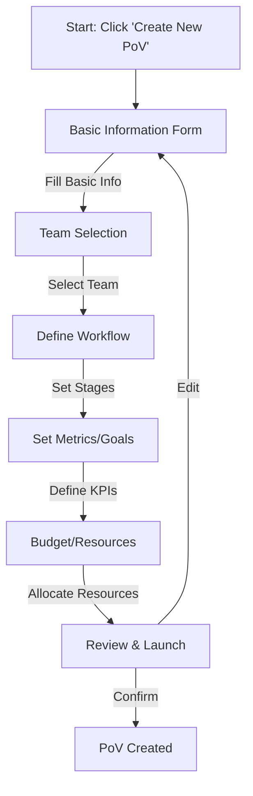
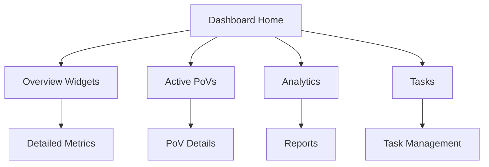

# Application Workflows and Wireframes

## PoV Creation Flow



### Step Details

1. **Basic Information Form**
   - PoV Name [Auto from CRM/Manual]
   - Created Date [Auto]
   - Opportunity Name [From CRM]
   - Revenue [From CRM]
   - Forecast Date [From CRM]
   - Customer Name [From CRM]
   - Customer Contact [From CRM]
   - Partner Name [From CRM]
   - Partner Contact [From CRM]
   - Status [Dropdown: Projected/InProgress/Stalled/Validation/Successful/Unsuccessful]
   - Start/End Dates [Date Pickers]
   - Objective [Text Area]
   - Solution [From CRM/Manual]

2. **Team Selection**
   - Project Manager [Dropdown]
   - Sales Engineer(s) [Multi-select]
   - Technical Team [Multi-select]
   - Role assignments
   - Permissions setup

3. **Workflow Definition**
   - Stages:
     * Initiation
       - Scope, Roles & Responsibilities
       - Dependencies/Integrations
       - Use Cases/Success Metrics
       - Value Criteria
       - Competitive Assessment
       - Customer signoff
     * Setup
       - Internal provisioning
       - Customer provisioning
     * Execution
     * Evaluation/Validation
     * Closure

4. **Metrics and Goals**
   - Define KPIs
   - Set success criteria
   - Establish timeline
   - Configure monitoring

5. **Budget and Resources**
   - Budget allocation
   - Resource assignment
   - Timeline planning
   - Risk assessment

6. **Review and Launch**
   - Summary display
   - Confirmation workflow
   - Notification setup
   - Integration triggers

## Dashboard Navigation Flow



### Dashboard Components

1. **Header Section**
   - Search bar
   - Create PoV button
   - Notifications
   - User menu
   - Global actions

2. **Overview Widgets**
   - Active PoVs count
   - Success rate metrics
   - Upcoming milestones
   - Resource utilization
   - Risk indicators

3. **Quick Actions**
   - Create new PoV
   - View all projects
   - Generate reports
   - Access settings

4. **Navigation Menu**
   - Dashboard
   - PoVs
   - Tasks
   - Analytics
   - Settings

## Wireframe: Dashboard Overview

```
+------------------+------------------+------------------+
|    Header Bar                                        |
| [Search] [Create PoV] [Notifications] [User Menu]    |
+------------------+------------------+------------------+
|                  |                  |                 |
| Active PoVs      | Success Rate     | Milestones      |
| [Count: 12]      | [Chart: 75%]     | [Timeline]      |
|                  |                  |                 |
+------------------+------------------+-----------------+
|                  |                  |                 |
| Resource Usage   | Risk Overview    | Team Status     |
| [Chart]          | [Indicators]     | [Activity]      |
|                  |                  |                 |
+------------------+------------------+-----------------+
|                                                      |
|                  PoV List                            |
| +------------------------------------------------+ |
| | Name | Customer | Status | Progress | Due Date   | |
| |------|----------|---------|----------|-----------|
| | ...  | ...      | ...     | ...      | ...       | |
| +------------------------------------------------+ |
|                                                      |
+------------------------------------------------------+
```

## Next Steps

1. **Component Architecture**
   - Define reusable UI components
   - Create widget system
   - Implement layout components
   - Design form components

2. **Style Guide**
   - Define color system
   - Establish typography
   - Create spacing rules
   - Set responsive breakpoints

3. **Implementation Priority**
   - Dashboard layout
   - PoV creation flow
   - List views
   - Detail views
